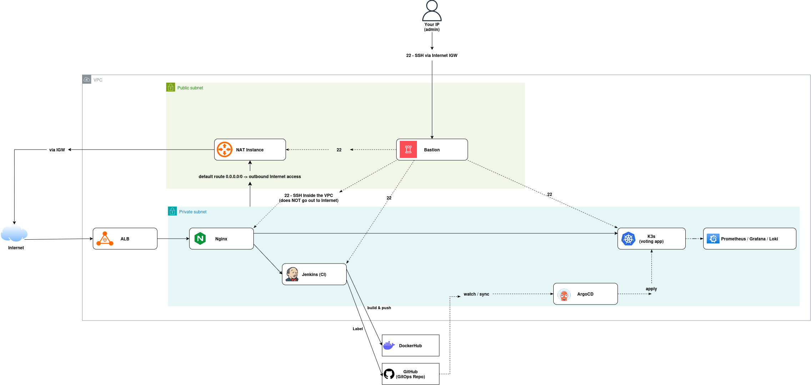

# AWS DevOps Project

**A hands-on DevOps learning path — from raw AWS infrastructure to a GitOps-driven, observable, microservices platform.**

---

## Overview

This repository documents a self-directed DevOps lab built entirely on AWS's free tier: a small, real-world platform deployed through Jenkins, containerized and orchestrated with Kubernetes, migrated to a GitOps delivery model with ArgoCD, and instrumented end-to-end with Prometheus, Grafana and Loki.

The project was first built **by hand** — provisioning and configuring everything manually through the AWS console and SSH — to properly understand each piece before automating it. **Terraform was introduced in parallel**, specifically to build that skill, and covers the AWS infrastructure layer: VPC, IAM, EC2, ALB, security groups, and the auto-shutdown Lambda. The internal configuration of each server — installing and configuring Jenkins, Nginx, Kubernetes, the monitoring stack, etc. — is **not** provisioned by Terraform; it's done manually / via `user_data` and shell commands, as documented step by step in each phase.

Every phase is documented step by step in [`docs/`](docs/) — including the architectural decisions, the trade-offs, and the incidents encountered along the way (see the [Mini GameDay](docs/phase-4/07-gameday.md)).

> **Status:** the live AWS infrastructure has since been decommissioned after exhausting the free tier — this repo now serves as the full build log and portfolio reference. Every module, pipeline and manifest still applies cleanly with `terraform validate` / `kubectl apply --dry-run`.

 High-level architecture — full detail (VPC, subnets, cluster internals) in <a href="docs/phase-5/06-observability.md">docs/</a>

---

## Table of Contents

- [Project Structure](#project-structure)
- [The Journey — Phase by Phase](#the-journey--phase-by-phase)
- [Architecture Evolution](#architecture-evolution)
- [Tech Stack](#tech-stack)
- [Roadmap](#roadmap)

---

## Project Structure

| Path | Contents |
|---|---|
| [`docs/`](docs/) | Full step-by-step write-up of every phase, with screenshots and diagrams |
| [`aws-infra/`](aws-infra/) | Terraform — VPC, IAM, EC2, ALB, Security Groups, auto-shutdown Lambda |
| [`k8s/`](k8s/) | Kubernetes manifests for the observability stack (Prometheus, Grafana, Loki, Alertmanager) |
| [`diagrams/`](diagrams/) | Architecture diagrams for each stage of the project |
| [`assets/`](assets/) | Screenshots referenced throughout the docs |

---

## The Journey — Phase by Phase

### Phase 1 — Infrastructure Foundations
Terraform-first AWS setup: least-privilege IAM, a custom VPC with public/private subnets, a bastion host, a **DIY NAT instance** (skipping the paid NAT Gateway), an internal Nginx instance, and an Application Load Balancer in front of it — plus a Lambda + EventBridge job that auto-shuts down instances to stay inside the free tier.
[`Phase 1`](docs/phase-1/)

### Phase 2 — Continuous Integration
Jenkins deployed on a private EC2 instance, reachable only through the Nginx reverse proxy, driving a **declarative Jenkinsfile** pipeline as the first step away from manual, UI-driven builds.
[`Phase 2`](docs/phase-2/)

### Phase 3 — Containers & Kubernetes (CIOps)
A K3s cluster joins the stack. Jenkins builds a Docker image, pushes it to Docker Hub, and runs `kubectl apply` directly against the cluster — a push-based **CIOps** model, deliberately built "the hard way" first to understand what GitOps later replaces.
[`Phase 3`](docs/phase-3/)

### Phase 4 — Observability & SRE
A full monitoring stack — Prometheus, Node Exporter, Grafana, Loki + Promtail, Alertmanager — instrumented against the running app, capped off with a **Mini GameDay** (a pod deliberately killed under load to watch self-healing, alerts and dashboards react) and a written SRE baseline (SLIs, SLOs, error budget).
[`Phase 4`](docs/phase-4/)

### Phase 5 — Cloud Native & GitOps
The single app is replaced with a 5-service distributed app (vote / result / worker / redis / postgres), split across **two repositories** — application code and GitOps manifests. Jenkins stops touching the cluster: it now only pushes image tags to Git, and **ArgoCD** reconciles the cluster state automatically. Ingress routing and the observability stack are extended to cover every microservice.
[`Phase 5`](docs/phase-5/)

---

## Architecture Evolution

| | CIOps (Phase 3) | GitOps (Phase 5) |
|---|---|---|
| **Deploy trigger** | Jenkins runs `kubectl apply` | Jenkins commits an image tag to Git |
| **Cluster access** | Jenkins holds cluster-admin credentials | Only ArgoCD (in-cluster) talks to the API |
| **Source of truth** | Whatever was last applied manually or by CI | The GitOps repository, always |
| **Drift** | Possible — manual `kubectl` changes go unnoticed | Detected and auto-corrected by ArgoCD |

---

## Tech Stack

**Infrastructure (Terraform)** — AWS VPC, EC2, ALB, IAM, Lambda, EventBridge
**Server configuration (manual)** — Jenkins, Nginx, Kubernetes (K3s) install & setup
**CI/CD** — Jenkins (declarative pipelines), GitOps with ArgoCD
**Containers & Orchestration** — Docker, Kubernetes (K3s)
**Networking** — Nginx (reverse proxy & ingress), custom EC2-based NAT
**Observability** — Prometheus, Grafana, Loki, Promtail, Alertmanager

---

## Roadmap

Planned next steps — not yet implemented in this repo:

- [ ] **DevSecOps** — Trivy image scanning + Gitleaks secret detection in the Jenkins pipeline, Kubernetes Network Policies
- [ ] **Helm** — convert the GitOps raw YAML manifests into a Helm chart with per-environment values
- [ ] **Autoscaling** — metrics-server + HPA on the vote/result deployments, load-tested with k6

---

Built as a personal DevOps learning project — every phase documented in <a href="docs/">docs/</a>.

