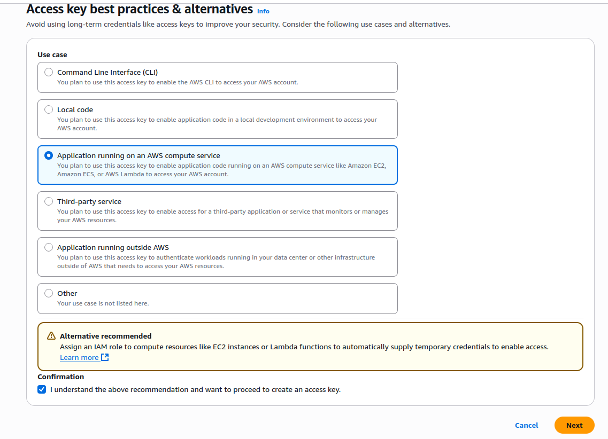

# Terraform AutoShutdown IAM Setup

This guide explains how to create a secure IAM user and permissions required to deploy the `auto-shutdown` Terraform module in AWS.

---

## Step 1: Create an IAM Group

1. Go to AWS Console → IAM → **User groups**.
2. Create a new group:
   - **Group name:** `terraform-autoshutdown-group`

---

## Step 2: Create a Custom IAM Policy

1. Go to **IAM → Policies → Create Policy**
2. Switch to the **JSON** tab and paste the following:

```json
{
	"Version": "2012-10-17",
	"Statement": [
		{
			"Sid": "IAMAccessForRoles",
			"Effect": "Allow",
			"Action": [
				"iam:CreateRole",
				"iam:DeleteRole",
				"iam:GetRole",
				"iam:PassRole",
				"iam:AttachRolePolicy",
				"iam:DetachRolePolicy",
				"iam:ListRolePolicies",
				"iam:ListAttachedRolePolicies",
				"iam:ListInstanceProfilesForRole"
			],
			"Resource": "*"
		},
		{
			"Sid": "LambdaManagement",
			"Effect": "Allow",
			"Action": [
				"lambda:CreateFunction",
				"lambda:DeleteFunction",
				"lambda:GetFunction",
				"lambda:UpdateFunctionCode",
				"lambda:UpdateFunctionConfiguration",
				"lambda:AddPermission",
				"lambda:RemovePermission",
				"lambda:ListVersionsByFunction",
				"lambda:GetFunctionCodeSigningConfig",
				"lambda:GetPolicy"
			],
			"Resource": "*"
		},
		{
			"Sid": "EventBridgeAccess",
			"Effect": "Allow",
			"Action": [
				"events:PutRule",
				"events:DeleteRule",
				"events:DescribeRule",
				"events:PutTargets",
				"events:RemoveTargets",
				"events:ListTagsForResource",
				"events:ListTargetsByRule"
			],
			"Resource": "*"
		},
		{
			"Sid": "EC2Minimal",
			"Effect": "Allow",
			"Action": [
				"ec2:DescribeInstances",
				"ec2:StopInstances"
			],
			"Resource": "*"
		},
		{
			"Sid": "CloudWatchLogs",
			"Effect": "Allow",
			"Action": [
				"logs:CreateLogGroup",
				"logs:CreateLogStream",
				"logs:PutLogEvents"
			],
			"Resource": "*"
		}
	]
}
```
3. Name the policy: `TerraformAutoShutdownPolicy`
4. Attach the policy to the `terraform-autoshutdown-group`.

## Step 3: Create an IAM User

1. Go to **IAM → Users → Add users**
2. Name: `terraform-autoshutdown`
3. Add the user to the group **terraform-autoshutdown-group`
4. After creation, go to **IAM → Users → terraform-autoshutdown**
5. Go to **Security Credentials** in the Access keys and select **Create access keys**
6. And put this options

7. After this save the access key and the secret key.

## Step 4: Configure AWS CLI Profile

In your terminal, run:

```bash 
aws configure --profile terraform-autoshutdown
```
Enter the following when prompted:
```bash
AWS Access Key ID:     <your access key>
AWS Secret Access Key: <your secret key>
Default region name:   eu-west-1
Default output format: json
```