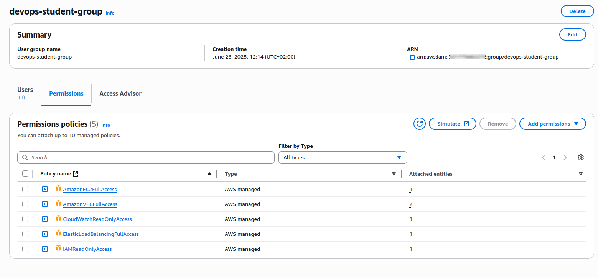
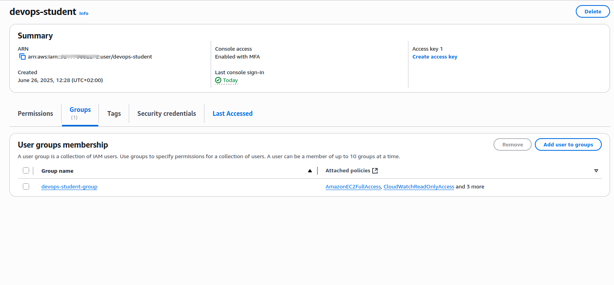
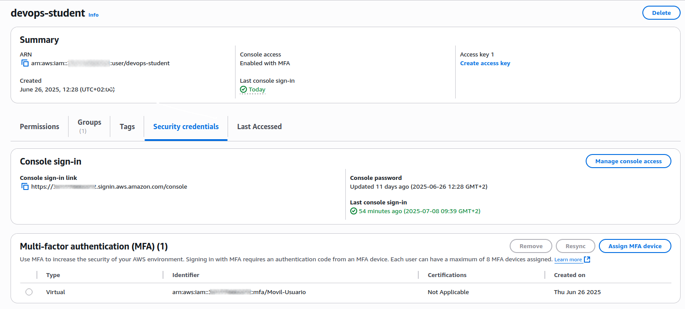

# Phase 1 - Step 1: IAM Configuration

## Objective 
Create a group and a userfollowing the best practices from the start, ensuring a secure and minimal-permission environment.

---

## A. Create IAM Group

- **Path:** `IAM → Groups → Create group`
- **Group name:** `devops-student-group`
- **Attached policies:**
    - `AmazonEC2FullAccess`
    - `AmazonVPCFullAccess`
    - `ElasticLoadBalancingFullAccess`
    - `IAMReadOnlyAccess`
    - `CloudWatchReadOnlyAccess`



> ⚠️ Avoid using `AdministratorAccess` to follow the principle of least privilige
s

### Terraform equivalent
```hcl
resource "aws_iam_group" "devops_student_group" {
  name = "devops-student-group"
}

resource "aws_iam_group_policy_attachment" "ec2" {
  group      = aws_iam_group.devops_student_group.name
  policy_arn = "arn:aws:iam::aws:policy/AmazonEC2FullAccess"
}

resource "aws_iam_group_policy_attachment" "vpc" {
  group      = aws_iam_group.devops_student_group.name
  policy_arn = "arn:aws:iam::aws:policy/AmazonVPCFullAccess"
}

resource "aws_iam_group_policy_attachment" "elb" {
  group      = aws_iam_group.devops_student_group.name
  policy_arn = "arn:aws:iam::aws:policy/ElasticLoadBalancingFullAccess"
}

resource "aws_iam_group_policy_attachment" "iam_readonly" {
  group      = aws_iam_group.devops_student_group.name
  policy_arn = "arn:aws:iam::aws:policy/IAMReadOnlyAccess"
}

resource "aws_iam_group_policy_attachment" "cloudwatch_readonly" {
  group      = aws_iam_group.devops_student_group.name
  policy_arn = "arn:aws:iam::aws:policy/CloudWatchReadOnlyAccess"
}
```

---

## B. Create IAM User

- **Path:** `IAM → Users → Add user`
- **Username:** `devops-student`
- **Access type:**
    - Programmatic access 
    - AWS Console access
- **Group membership:** `devops-student-group`



### Terraform equivalent
```hcl
resource "aws_iam_user" "devops_student" {
  name          = "devops-student"
  force_destroy = true
}

resource "aws_iam_user_login_profile" "login_profile" {
  user                    = aws_iam_user.devops_student.name
  password_reset_required = true
}

resource "aws_iam_user_group_membership" "membership" {
  user   = aws_iam_user.devops_student.name
  groups = [aws_iam_group.devops_student_group.name]
}
```

---

## C. Enable MFA 
- Path: `IAM → Users → devops-student → Security credentials → Enable MFA`
- Type: Virtual MFA device (Google auth)
- Status: Succesfully enabled

> ⚠️ MFA setup cannot be done via Terraform for virtual MFA devices. It must be configured manually from the AWS Console.



---

## Notes
In real-world scenarios, you should avoid hardcoding credentials. Instead, it is recommend creating:

- An IAM group: `TerraformAdmin`
- An IAM user: `TerraformUser`

This user will authenticate via AWS CLI using programmatic access (access keys). The access credentials should be stored securely and passed via environment variables or config files (e.g., `~/.aws/credentials`). In my case I am storing them via awscli.

---

## Terraform
[View Terraform(IAM)](../../aws-infra/modules/iam)