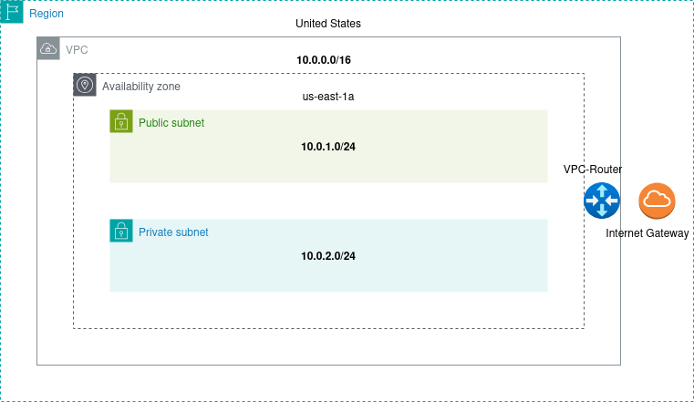
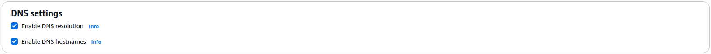
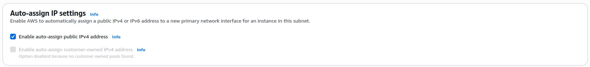
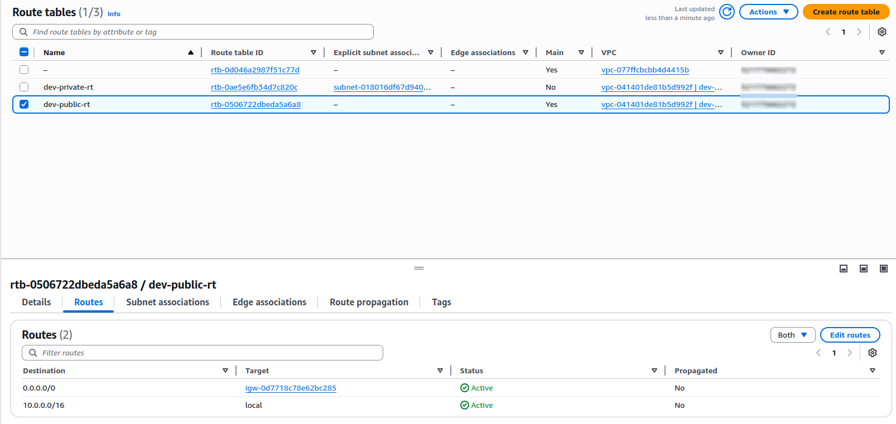

# VPC Setup Guide


This guide outlines the steps to manually set up a development VPC with a public and private subnet in AWS.

## Create VPC

1. Go to **Create VPC**
    - **Name:** `dev-vpc`
    - **IPv4 CIDR Block:** `10.0.0.0/16`
    - Click **Create VPC**

2. After creation:
    - Go to **Actions → Edit VPC settings → Enable DNS hostnames**



> Enabling **DNS hostnames** allows instances within the VPC to receive **public DNS names** 
> This is quite usefull for public subnets, where instances need to be reacheable from the internet. Without DNS hostnames enabled, even if an instance has a public IP, it won't have a public DNS names, making remote access and service that depend on DNS more difficult.


> ⚠️ After the creation, you might see an error:
> ```
> "Route 53 Resolver DNS Firewall rule groups"
> ```
> This means that a group of DNS firewall rules from Route 53 could not be assciated with the VPC. You can ignore because we are not building an environment that filter outgoing DNS traffic.

---

## Create Subnets

1. **Public Subnet**
    - **Name:** `dev-publi-1a`
    - **Availability Zone:** N.Virginia (`us-east-1a`)
    - **IPv4 VPC CIDR block:** `10.0.0.0/16`
    - **Ipv4 Subnet CIDR block:** `10.0.1.0/24`

2. **Private Subnet**
    - **Name:** `dev-private-1a`
    - **Availability Zone:** N.Virginia (`us-east-1a`)
    - **IPv4 VPC CIDR block:** `10.0.0.0/16`
    - **IPv4 Subnet CIDR block:** `10.0.2.0/24`

3. After subnet creation:
    - For 'dev-public-1a`, go to **Actions → Edit subnet settings**
    - Enable **Auto-assign public IPv4 address**
    -Click **Save**




>Instances in a **public subnet** need a **public IPv4 address** to communicate with the internet directly via the **Internet Gateway (IGW)**.  
> Enabling this ensures every EC2 instance launched into this subnet automatically gets a public IP.

> In contrast, **private subnets** do **not** have internet access directly.  
> Giving them public IPs is not only unnecessary it also defeats the purpose of network isolation in private subnets.

---

## Create Route Tables

1. **Private Route Table**
    - **Name:** `dev-private-rt`
    - **VPC:** `dev-vpc`
    - Click **Create route table**

2. Associate subnet:
    - Go to **Subnet associations**
    - Click **Edit subnet associations** of the **Explicit subnet associations** part
    - Choose `dev-private-1a`
    - Save associations


3. **Public Route Table**
    - AWS creates a default route table under the name `-`
    - Rename this to `dev-public-rt` (or as desired)
    - In its **subnet association** section, you will see that `dev-public-1a`is already associated (no action needed) 

---

## Create Internet Gateway (IGW)

1. Go to **Create Internet Gateway**
    - **Name:** `dev-igw`
    - Click **Create**

2. After creation:
    - Go to ** Actions → Attach to VPC**
    - Select VPC: `dev-vpc`
    - Click **Attach**

---

## Route Internet Traffic

1. In **Route Tables**, select `dev-public-rt` (associated with `dev-public-1a`)

2. Add a new route:
    - **Destination:** `0.0.0.0/0`
    - **Target:** Internet Gateway → `dev-igw`



> All traffic within the CIDR block (`10.0.0.0/16`) will be routed **locally** by the VPC router. 
> Everything outside of the CIDR block will be routed to the **internet** via the **Internet Gateway**

3. Click **Save changes**

---

## Notes

**Every VPC includes an internal router managed by AWS.**

- This **VPC router** handles all routing between subnets and external components.
- You don't create it manually, it's automatically included when you create a VPC.
- It uses the **route tables** to determine how to forward traffic, whether it's within the VPC or going out to the internet.

