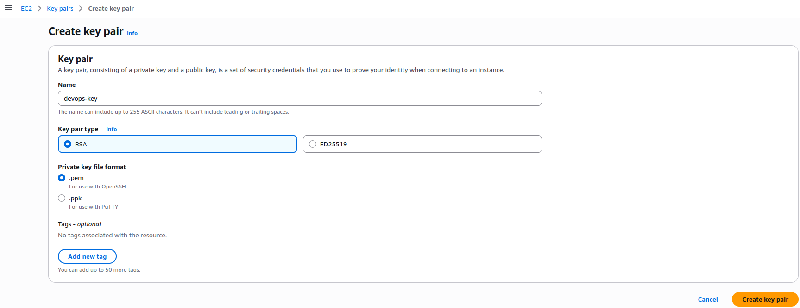

# Phase 1 - Step 3: SSH Key

## Objective
Create a secure SSH key pair to access EC2 instances.

## A. Create SSH Key

1. In the AWS Console, go to:
    **EC2 → Key Pairs → Create key pair**
    - **Key pair name:** `dev-key`
    - Leave the rest as default settings



2. After creation, a file named devops-key.pem will be downloaded automatically.

3. Move the `.pem` file to your SSH directory and set secure permissions:

```bash
cd ~/Downloads
mv devops-key.pem ~/.ssh/
cd ~/.ssh/
chmod 400 devops-key.pem
```

> ⚠️ Run these commands as your normal user not as **root**.
> Using `chmod 400` ensures only your user can read the key.

---

## Notes   

> Later on, we will associate this SSH key with the EC2 instances we need. Generating the key through AWS provides a simpler way to configure SSH access, compared to creating one locally and adding it manually.