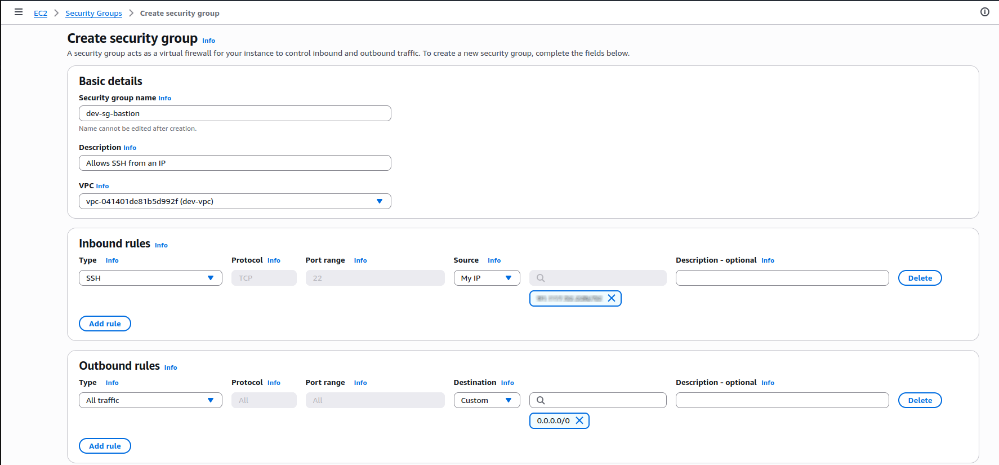
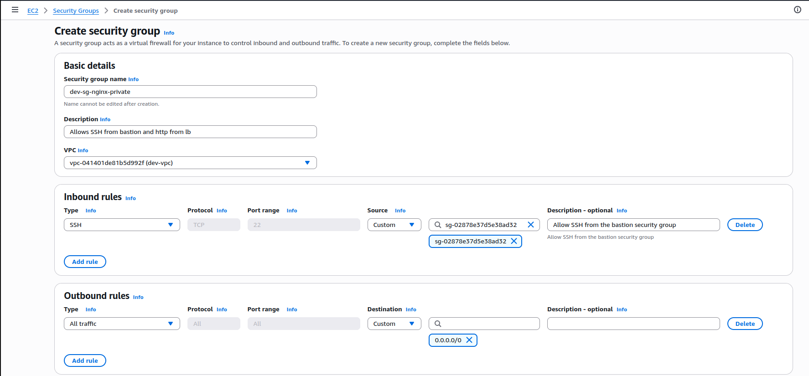

# Phase 1 - Step 4: Security Groups

## Objective
Configure two security groups to control access to the **public** and **private** subnets within the VPC.

---

## A. Create sg-bastion group

**Path:** `EC2 → Security Groups → Create security group`

1. Click on **Create security group**
    -**Security group name:** `dev-sg-bastion`
    -**Description:** Allows SSH access from your personal IP
    -**VPC:** Select `dev-vpc` (created earlier)
    -**Inbound rules:** 
    | Type         | Protocol | Port Range | Source                               | Description            |
    |--------------|----------|------------|--------------------------------------|------------------------|
    | SSH          | TCP      | 22         | Your IP (e.g., `X.X.X.X/32`)         | For SSH access only    |
    -**Outbound rules:** Let the default rule (All traffic allowed)

2. Click on `Create security group`

---

## B. Create sg-nginx-private group

**Path:** `EC2 → Security Groups → Create security group`

1. Click on **Create security group**
    -**Security group name:** `dev-sg-nginx-private`
    -**Description:** Allows SSH from Bastion and allows HTTP from the Load Balancer
    -**VPC:** Select `dev-vpc` (created earlier)
    -**Inbound rules:** 
    | Type         | Protocol | Port Range | Source                               | Description            |
    |--------------|----------|------------|--------------------------------------|------------------------|
    | SSH          | TCP      | 22         | Bastion SG                           | For SSH access only    |
    | HTTP         | TCP      | 80         | Custom `10.0.0.0/16`                 |                        |
    | HTTPS        | TCP      | 443        | Custom `10.0.0.0/16`                 |                        |        

    -**Outbound rules:** Let the default rule (All traffic allowed)
    | Type         | Protocol | Port Range | Destination | Description        |
    |--------------|----------|------------|-------------|--------------------|
    | All traffic  | All      | All        | `0.0.0.0/0` | Allow all outbound |
2. Click on `Create security group`

> ⚠️ You will later add an inbound rule to allow **HTTP (port 80)** traffic **from the Load Balancer**.  
> This requires the Load Balancer’s security group to be created first.

## Terraform
[View Terraform(SG)](../../aws-infra/modules/security-groups/)