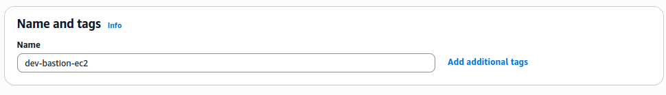
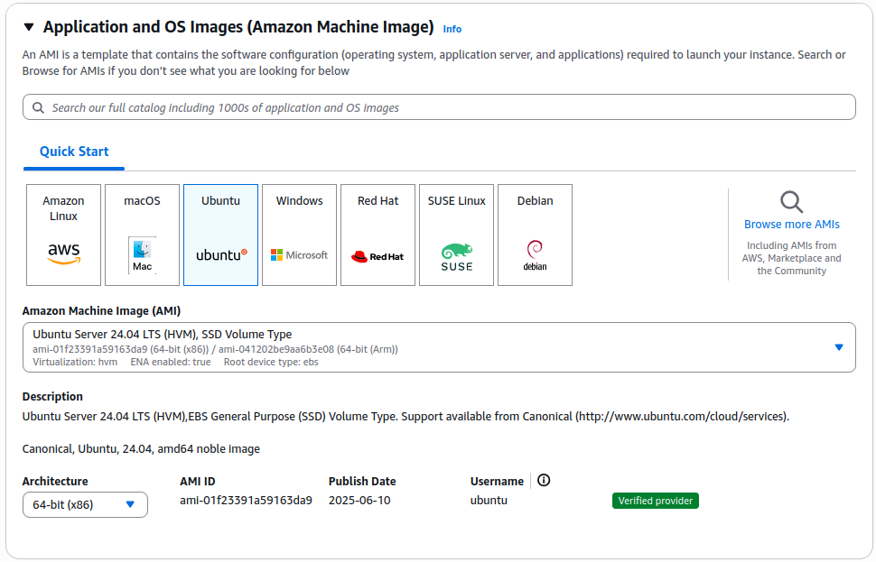
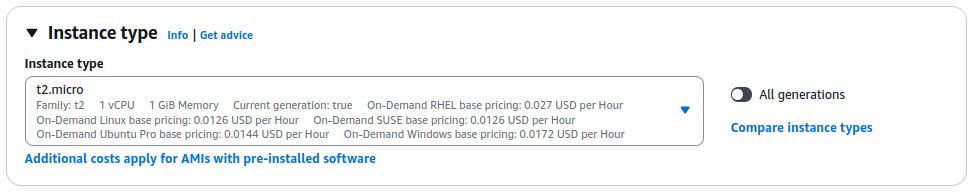
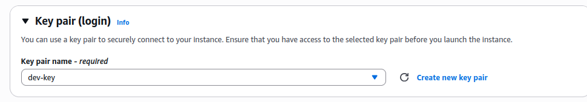
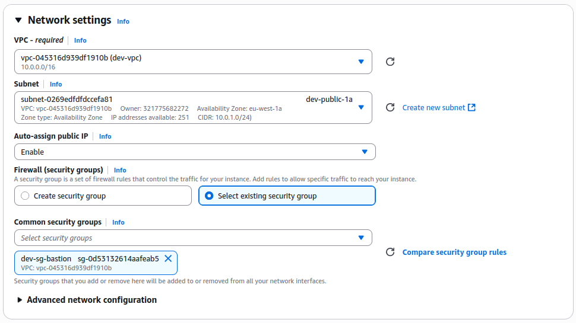
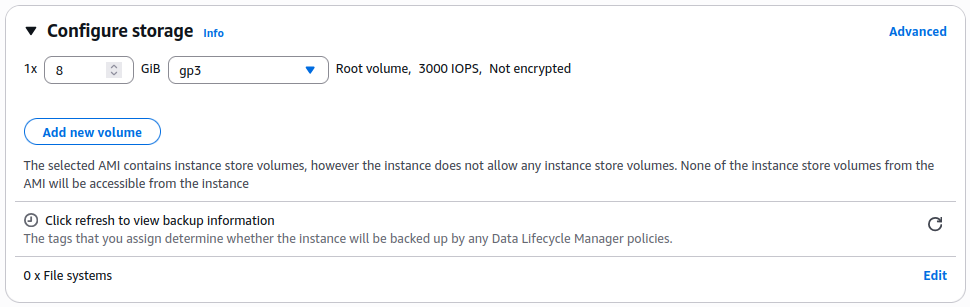

# Phase 1 - Step 5: EC2 Bastion

## Objective
Configure an EC2 instance (Bastion Host) in the **public subnet** (`dev-public-1a`) to allow secure SSH access into the private network using a key pair.

---

## Requirements

- Complete the previous steps (VPC, subnet, key pair, security groups)
- Ensure your key file `dev-key.pem` is created and located.

---

## A. Launch the EC2 Instance

### 1. Go to the EC2 > **Instances**

From the AWS Console, open the EC2 service and click **Instances** from the left sidebar.

---

### 2. Click **Launch instances**

- **Instance name:** `dev-bastion-ec2`



---

### 3. Choose AMI (Amazon Machine Image)

- Select: `Ubuntu Server 24.04 LTS (HVM), SSD Volume Type`



---   

### 4. Choose Instance Type

- Select: `t2.micro`



---

### 5. Create or Select Key Pair

-Use an existing key pair (`dev-key.pem`)



---

### 6. Network 

Click **Edit** in Network settings:
    - **VPC:** Select your custom VPC (`dev-vpc`)
    - **Subnet:** Select your public subnet (`dev-public-1a`)
    - **Auto-assign Public IP:** **Enable**
    - **Firewall (Security Group):**
        - Choose an existing one (`dev-sg-bastion`)  



---

### 7. Configure Storage
    
    - Default: 8GB SSD



---

### 8. Review and Launch

- Review everything, then click **Launch Instance**

---

### Connect to the Instance

After launching:

1. Copy the **public IP** from the EC2 instance.
2. From your terminal (go where you have the key pair):

```bash
ssh -i devops-key.pem ubuntu@<YOUR_PUBLIC_IP>
```s

## Terraform
[View Terraform(bastion)](../../aws-infra/modules/bastion/)