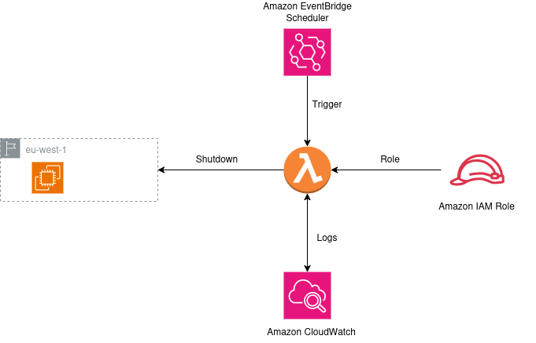
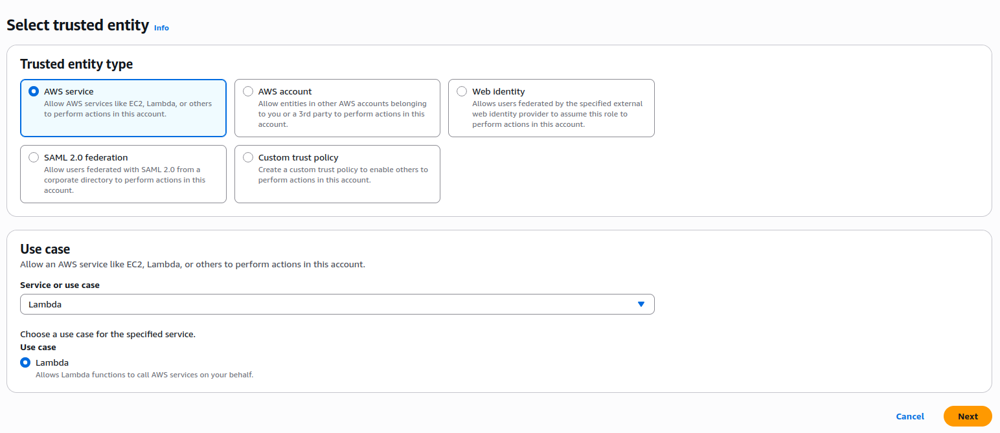
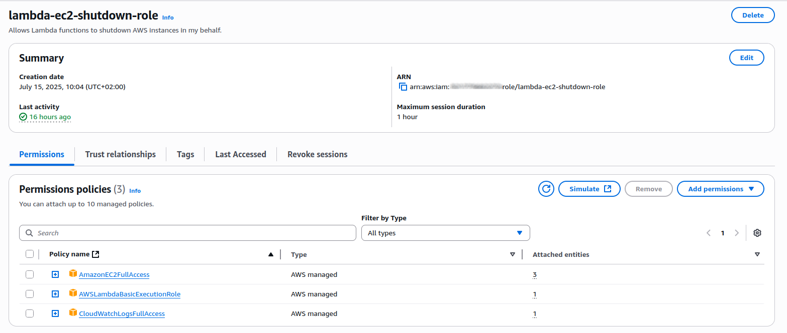
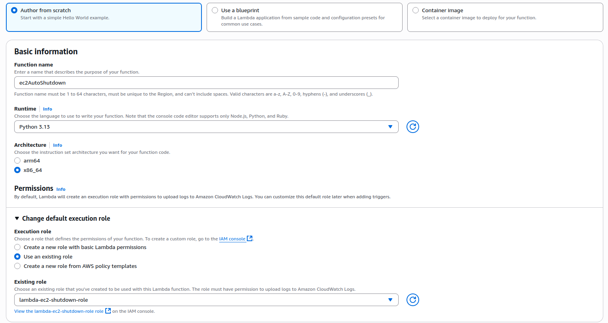
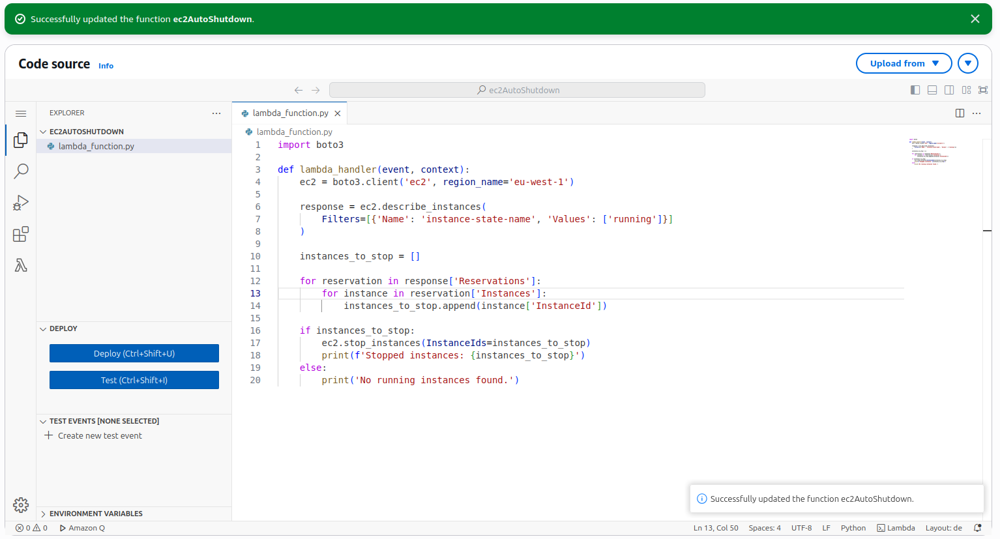
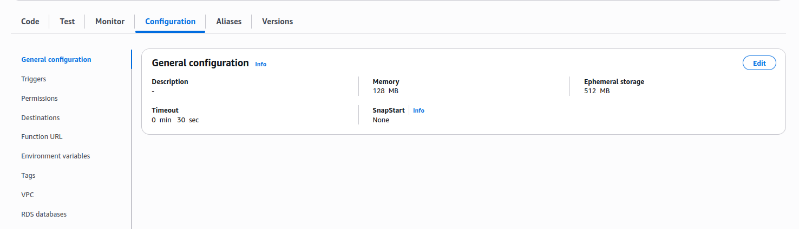
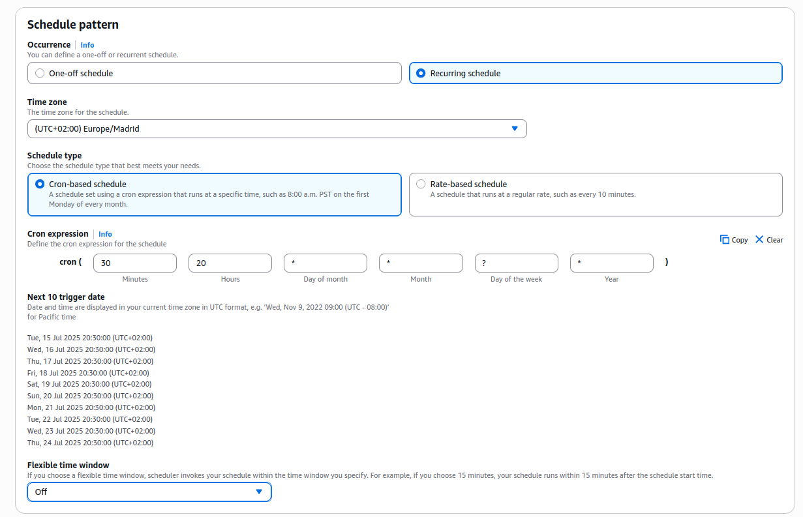
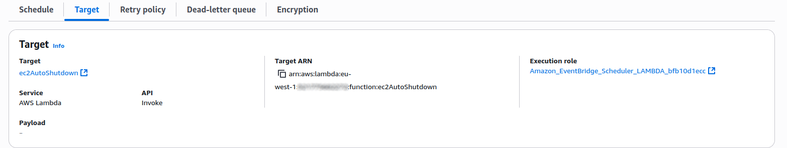
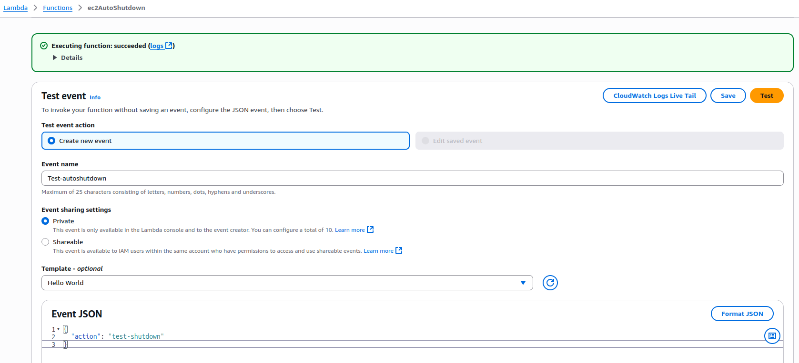

# Phase 1 - Step 6: AutoShutdown



## Objective

Configure auto-shutdown for your EC2 instances using AWS Lambda and EventBridge. This helps to avoid unnecessary usage charges by stopping instances automatically at a set time.
---

## Requirements

- At least one EC2 instance running.
- IAM role with Lambda and EC2 permissions.
- AWS Free Tier account.

---


## A. Create the IAM Role for Lambda

### 1. Go to **IAM > Roles**

### 2. Click **Create role**:
- **Trusted entity type:** AWS service
- **Use case:** Lambda
- Click **Next**



### 3. Add Permissions:
- Attach the following policies:
  - `AWSLambdaBasicExecutionRole` (required for logging)
  - `AmazonEC2FullAccess` (or custom policy allowing `ec2:StopInstances`)
  - `CloudWatchLogsFullAcces`

### 4. Name the role:
- **Role name:** `lambda-ec2-shutdown-role`


---

## B. Create the Lambda Function

### 1. Go to **Lambda** in the AWS Console.

### 2. Click on **Create function**:
- **Function name:** `ec2AutoShutdown`
- **Runtime:** `Python 3.13`
- **Execution role:** Use **existing role**
  - Select `lambda-ec2-shutdown-role`



---

## C. Add the Lambda Code

### 1. Replace the default code with:

```python
import boto3

def lambda_handler(event, context):
    ec2 = boto3.client('ec2', region_name='eu-west-1')

    response = ec2.describe_instances(
        Filters=[{'Name': 'instance-state-name', 'Values': ['running']}]
    )

    instances_to_stop = []

    for reservation in response['Reservations']:
        for instance in reservation['Instances']:
            instances_to_stop.append(instance['InstanceId'])

    if instances_to_stop:
        ec2.stop_instances(InstanceIds=instances_to_stop)
        print(f'Stopped instances: {instances_to_stop}')
    else:
        print('No running instances found.')
        
```



---

## D. Adjust Lambda Settings

### 1. Set a longer timeout:
- Go to **Configuration > General configuration.**
- Click **Edit** and set timeout to `30 seconds.`

>We set it to 30 seconds because the code needs time to run, and 10 seconds might not be enough.



---

## E. Create the EventBridge Rule

### 1. Go to Amazon EventBridge

### 2. Click Create rule:
- **Name:** `shutdown-ec2-daily`
- **Description:** `Shutdowns all ec2 instances to a exact time`
- **Rule type:** `Schedule`
- **Schedule pattern:** Recurring scedule
- **Time zone:** Select the one for you
- **Schedule type:** Cron-based schedule
- **Cron expresiion:** cron ( 30 20 * * ? *)
- **Flexible time window:** Off, so the rule is going to be executed at the same exact time as the cron.



### 3. Add Target
- Click **Template targets**
- **Target type:** AWS Lambda
- **Lambda Function:** Select the previous function `ec2AutoShutdown`



### 4. Settings
- **Action after schedule completion:** NONE
- **Permissions:** Use existing role (`lambda-ec2-shutdown-role`)


---

## F. Test It

### 1. Manually trigger the Lambda:
- From the Lambda Console, click **Test**
- Confirm that your EC2 instance is stopped succesfully.
- **Event JSON:** 
```json
    {
        "action": "test-shutdown"
    }
```


## Terraform
[View Terraform(autoshutdown)](../../aws-infra/modules/auto-shutdown/)
