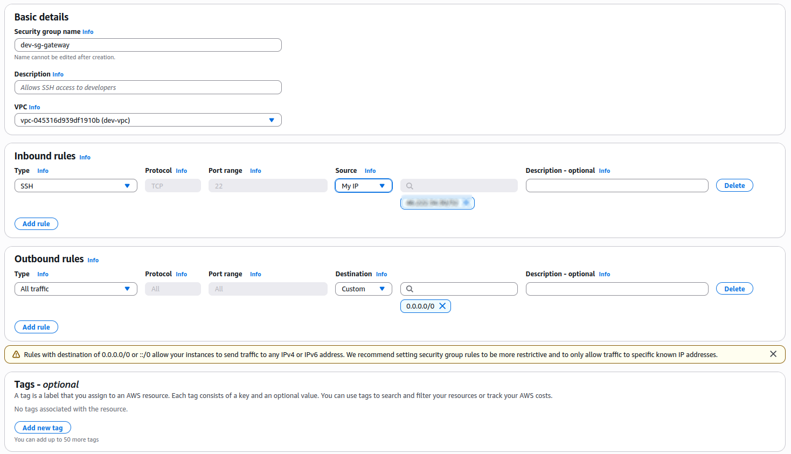
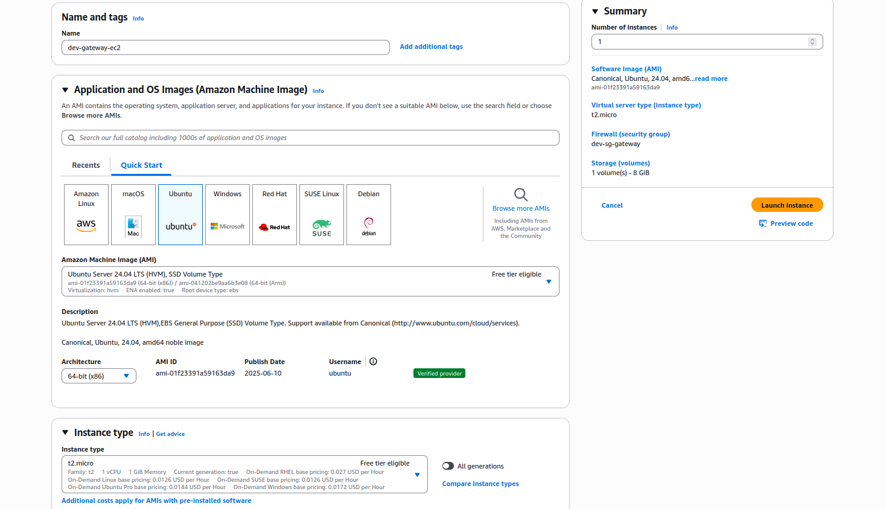
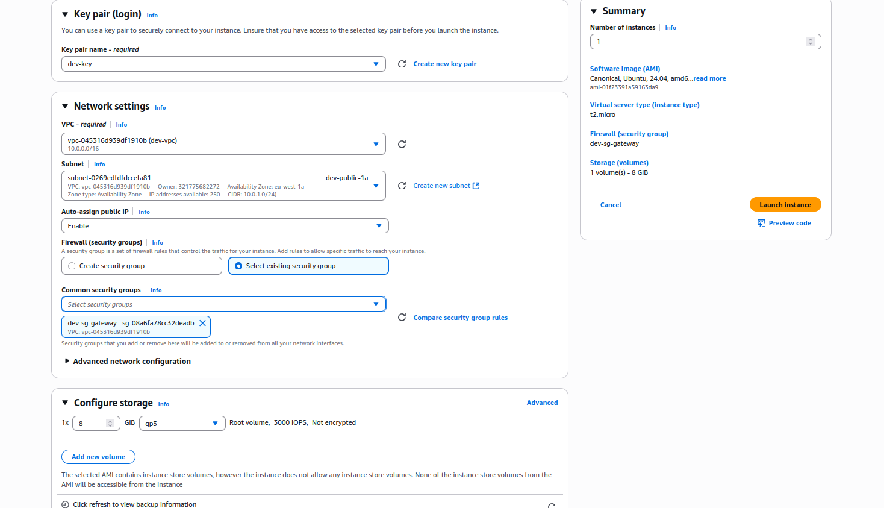
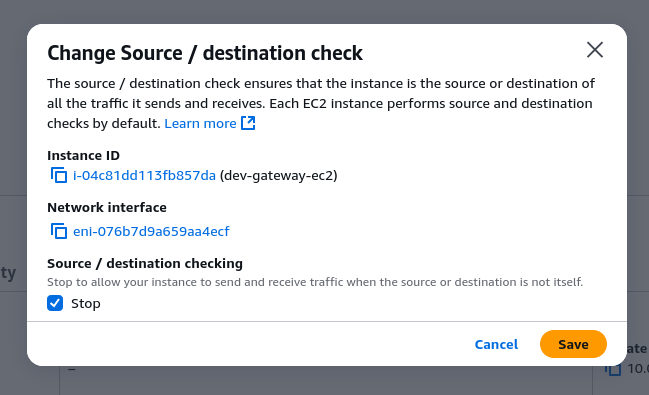
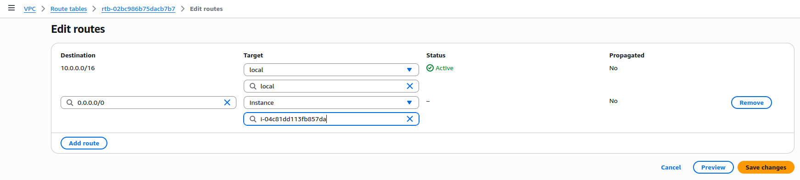

# Phase 1 - Step 7: NAT Gateway EC2 (Custom)

## Objective

Create a low-cost NAT Gateway using an EC2 instance in the public subnet to allow instances in the private subnet to access the internet — avoiding the paid NAT Gateway service. All is included in the free tier.
---

## Requirements

- All the previous steps completed.
- Free Tier eligible AWS account.

---

## A. Create the Security Group

### 1. Go to **EC2 > Security Groups**

### 2. Click **Create security group**:
- **Name:** `dev-sg-gateway`
- **Description:** `SG for the instance gateway`
- **VPC:** Select your existing VPC


### 3. Add **Inbound rules**:
| Type         | Protocol | Port Range | Source                               | Description            |
|--------------|----------|------------|--------------------------------------|------------------------|
| SSH          | TCP      | 22         | Your IP (e.g., `X.X.X.X/32`)         | For SSH access only     |

### 4. Add **Outbound rules**:
| Type         | Protocol | Port Range | Destination | Description        |
|--------------|----------|------------|-------------|--------------------|
| All traffic  | All      | All        | `0.0.0.0/0` | Allow all outbound |

Click **Create security group**.



---

## B. Launch the NAT Instance

### 1. Go to **EC2 > Instances > Launch Instance**

### 2. Configure instance:
- **Name:** `dev-gateway-ec2`
- **AMI:** Ubuntu Server 22.04 LTS
- **Instance type:** `t2.micro` 



- **Key pair:** dev-key
- **Network:**  dev-vpc
- **Subnet:** dev-public-subnet
- **Auto-assign public IP:** **Enable**
- **Firewall (Security Group):** Select `dev-sg-gateway`

### 3. Storage configuration:
- **Volume type:** gp3
- **Size:** `8 GiB`



Click **Launch Instance**.

### 4. Go to **Instance(dev-gateway-ec2) > Actions > Networking > Change source/destination check 



---

## C. Edit the Private Route Table

### 1. Go to **VPC > Route Table > dev-private-rt > Routes > Edit routes**

### 2. Configure the new route:
- **Destination:** `0.0.0.0/0`
- **Target:** instance(dev-gateway-ec2)

Click **Save Changes**



---

## D. Configure the instance (Enable NAT)

### 1. Connect via SSH

```bash
ssh -i your-key.pem ubuntu@<public-ip>
```

### 2. Enable IP forwarding
Edit the `sysctl.conf` file:

```bash
sudo nano /etc/sysctl.conf
```
Add this line:
```bash
net.ipv4.ip_forward = 1
```
Then apply:
```bash
sudo sysctl -p
```

### 3. Set up iptables MASQUERADE rule
```bash
sudo iptables -t nat -A POSTROUTING -o enX0 -s 10.0.2.0/24 -j MASQUERADE
```

### 4. Install iptables-persistent (to make the rules persist after the reboot)

```bash
sudo apt update
sudo apt install iptables-persistent
```
Mark `YES` in every option that pops.

Then save rules:
```bash
sudo netfilter-persistent save
```

## Notes   

> Later on, if you stop the nat instance the route table rule will have the **black hole status**. It is due to the instance stop status.

## Terraform
[View Terraform(instance-gateway)](../../aws-infra/modules/instance-gateway/)