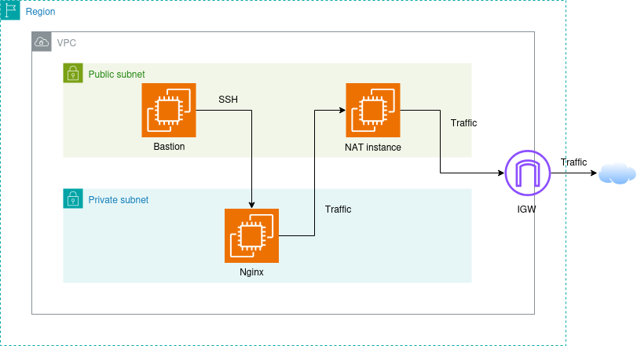
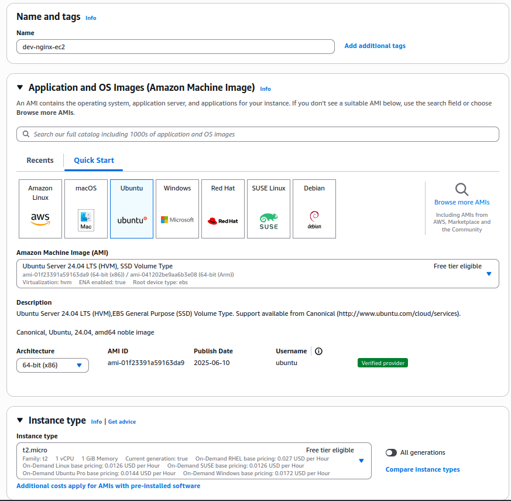
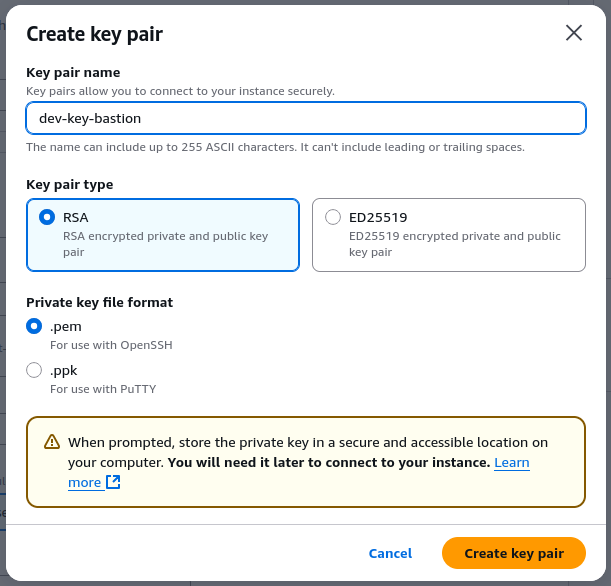
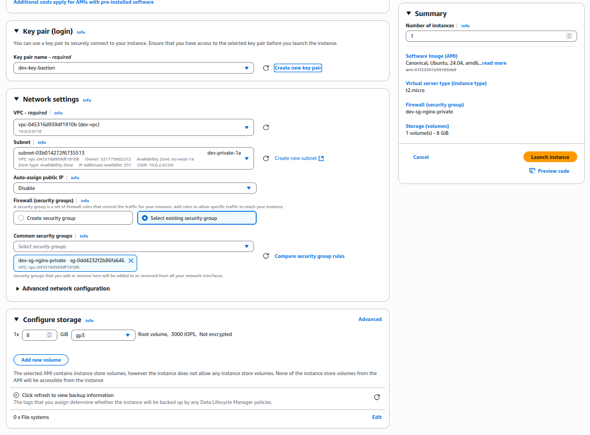

# Phase 1 - Step 8: EC2 Nginx



## Objective

Create an instance in the private subnet and install nginx in it.
---

## Requirements

- All the previous steps completed.
- Free Tier eligible AWS account.

---

## A. Launch the EC2 Instance

### 1. Go to the EC2 > **Instances**

From the AWS Console, open the EC2 service and click **Instances** from the left sidebar.

---

### 2. Click **Launch instances**

- **Instance name:** `dev-nginx-ec2`

---

### 3. Choose AMI (Amazon Machine Image)

- Select: `Ubuntu Server 22.04 LTS (HVM), SSD Volume Type`

---   

### 4. Choose Instance Type

- Select: `t2.micro`



---

### 5. Create or Select Key Pair

-Create a new Key Pair and name it (`dev-key-bastion`)



---

### 6. Network 

Click **Edit** in Network settings:
    - **VPC:** Select your custom VPC (`dev-vpc`)
    - **Subnet:** Select your public subnet (`dev-private-1a`)
    - **Auto-assign Public IP:** **Disable**
    - **Firewall (Security Group):**
        - Choose an existing one (`dev-sg-nginx`)  

---

### 7. Configure Storage
    
    - Default: 8GB SSD



---

### 8. Review and Launch

- Review everything, then click **Launch Instance**

---

### Connect to the Instance

After launching:

1. Copy the **public IP** from the EC2 **BASTION** instance and the **private IP** of the **NGINX**.
2. From your terminal (go where you have the new key pair `dev-key-bastion`)

```bash
scp -i dev-key-bastion.pem ubuntu@<BASTION_PUBLIC_IP>:/home/ubuntu
ssh -i dev-key.pem ubuntu@<BASTION_PUBLIC_IP>
mv dev-key-bastion.pem .ssh/
chmod 400 dev-key-bastion.pem
ssh -i dev-key-bastion.pem ubuntu@<NGINX_PRIVATE_IP>
```
3. Install Nginx
```bash
sudo apt update -y
sudo apt upgrade -y
sudo apt install -y nginx
```

4. Check if it is installed

```bash
sudo systemctl start nginx
sudo systemctl enable nginx
sudo systemctl status nginx
```
> If everything is good you will see the service in `Running`state

## Terraform
[View Terraform(bastion)](../../aws-infra/modules/nginx/)