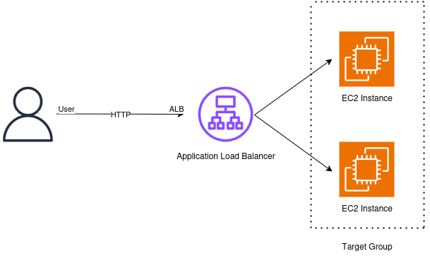
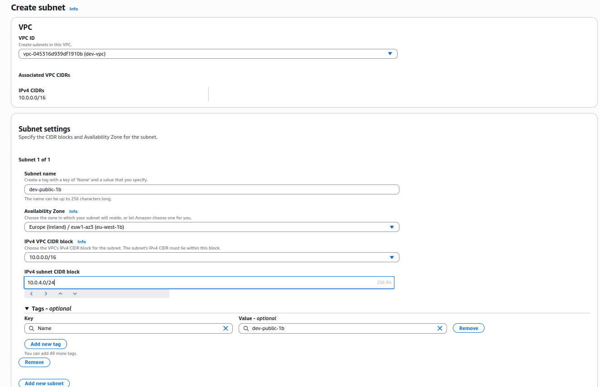
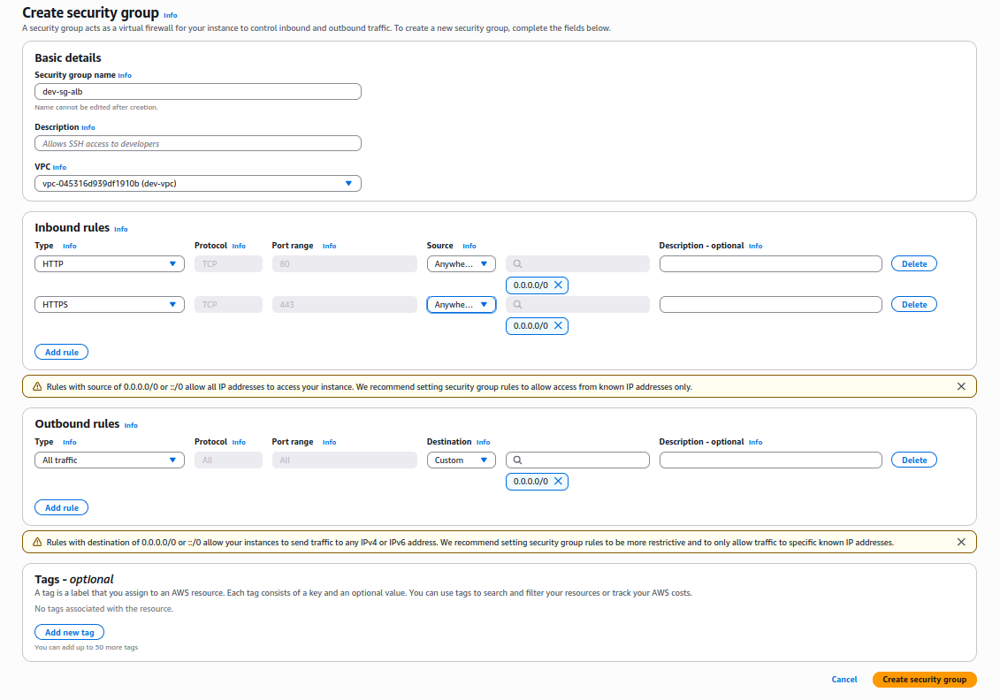
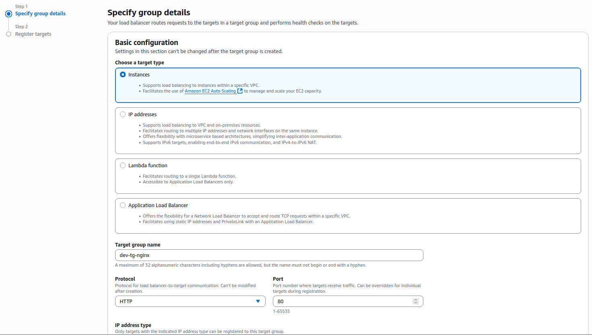
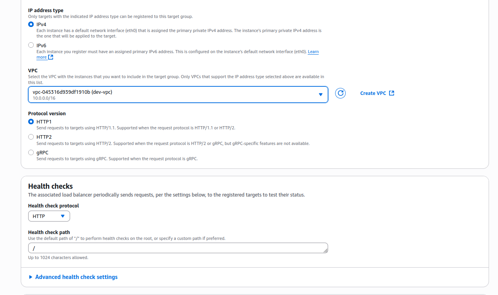
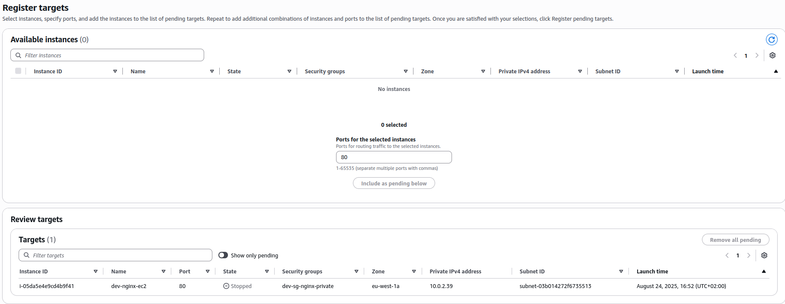
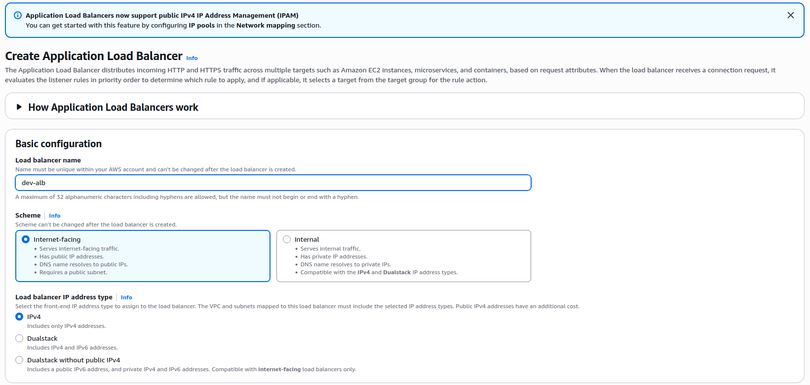
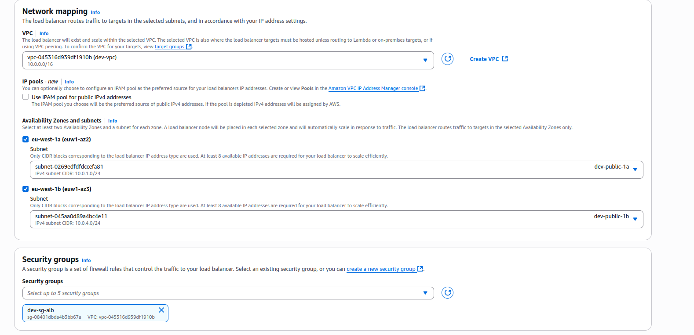
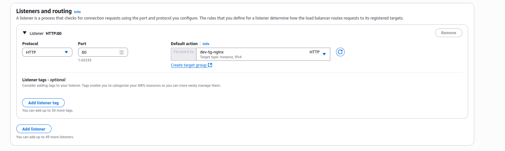

# Phase 1 - Step 9: EC2 Nginx

## Objective

Create an Application Load Balancer in the public subnets to expose the private NGINX instance securely over HTTP.

---

## Requirements

- All the previous steps completed.
- Free Tier eligible AWS account (⚠️ note: ALB is **not included in free tier** and will generate costs if left active).
- Two public subnets in different AZs (**We are gonna take over this step more forward**).

---

## A. Create an Additional Public Subnet

### 1. Go to **VPC > Subnets**

From the AWS Console, open the VPC service and click **Subnets** from the left sidebar.

---

### 2. Create Subnet

- **Name tag:** `dev-public-1b`
- **VPC:** Select your custom VPC (`dev-vpc`)
- **Availability Zone:** Choose a different AZ than your first public subnet (e.g., `eu-west-1b`)
- **IPv4 CIDR block:** `10.0.4.0/24` (adjust to your CIDR plan)

---

### 3. Edit Subnet Settings

- **Enable auto-assign public IPv4 address**: Go to Actions -> Edit subnet settings and click on auto-assign public IPv4 address.

> This ensures that instances launched here can get a public IP if required.

---

## B. Create Security Group for the ALB, and edit the nginx rules

### 1. Go to **EC2 > Security Groups**

Click **Create security group**.

---

### 2. Configure Details

- **Security group name:** `dev-sg-alb`
- **Description:** Security Group for ALB (allow HTTP/HTTPS from the internet)
- **VPC:** Select `dev-vpc`

---

### 3. Inbound Rules

| Type         | Protocol | Port Range | Source                               | Description            |
|--------------|----------|------------|--------------------------------------|------------------------|
| HTTP         | TCP      | 80         | 0.0.0.0/0                            | HTTP                   |
| HTTPS        | TCP      | 443        | 0.0.0.0/0                            | HTTPS                  |
---

### 4. Outbound Rules

| Type         | Protocol | Port Range | Destination | Description        |
|--------------|----------|------------|-------------|--------------------|
| All traffic  | All      | All        | `0.0.0.0/0` | Allow all outbound |

### 5. Add Inbound Rules (NGINX)

| Type         | Protocol | Port Range | Source                               | Description            |
|--------------|----------|------------|--------------------------------------|------------------------|
| HTTP         | TCP      | 80         | dev-sg-alb                           | HTTP                   |
| HTTPS        | TCP      | 443        | dev-sg-alb                           | HTTPS                  |

---

## C. Create Target Group

### 1. Go to the EC2 > **Target Groups**

From the AWS Console, open the EC2 service and click **Target Groups** from the left sidebar.

---

### 2. Create Target Group

- **Target group name:** `dev-tg-nginx`
- **Target type:** Instances
- **Protocol:** HTTP
- **Protocol version:** HTTP1
- **Port:** 80

- **VPC:** Select your custom VPC (`dev-vpc`)

---

### 3. Register Targets

- Select the **NGINX private instance** (`dev-nginx-ec2`)
- Click **Include as pending below**
- Then click **Create target group**

---

---

## D. Create Application Load Balancer

### 1. Go to EC2 > **Load Balancers**

Click **Create Load Balancer** and select **Application Load Balancer**.

---

### 2. Configure Basic Settings

- **Name:** `dev-alb`
- **Scheme:** Internet-facing
- **IP address type:** IPv4

---

### 3. Select Network

- **VPC:** `dev-vpc`
- **Mappings (Subnets):** Select two public subnets in different AZs  
  - `dev-public-1a`  
  - `dev-public-1b`  

---

### 4. Security Groups

- **Select existing SG:** `dev-sg-alb`

---

### 5. Configure Listeners and Routing

- **Listener 1:** HTTP (port 80) → Forward to `tg-nginx`

---

### 6. Review and Create

- Review configuration
- Click **Create Load Balancer**

---

## E. Test the ALB

1. Go to the **Description** tab of the ALB.
2. Copy the **DNS name**.
3. Test it in your browser:  
   - `http://<ALB_DNS>` → should return the NGINX default page.

---

## Terraform
[View Terraform(ALB)](../../aws-infra/modules/alb/)