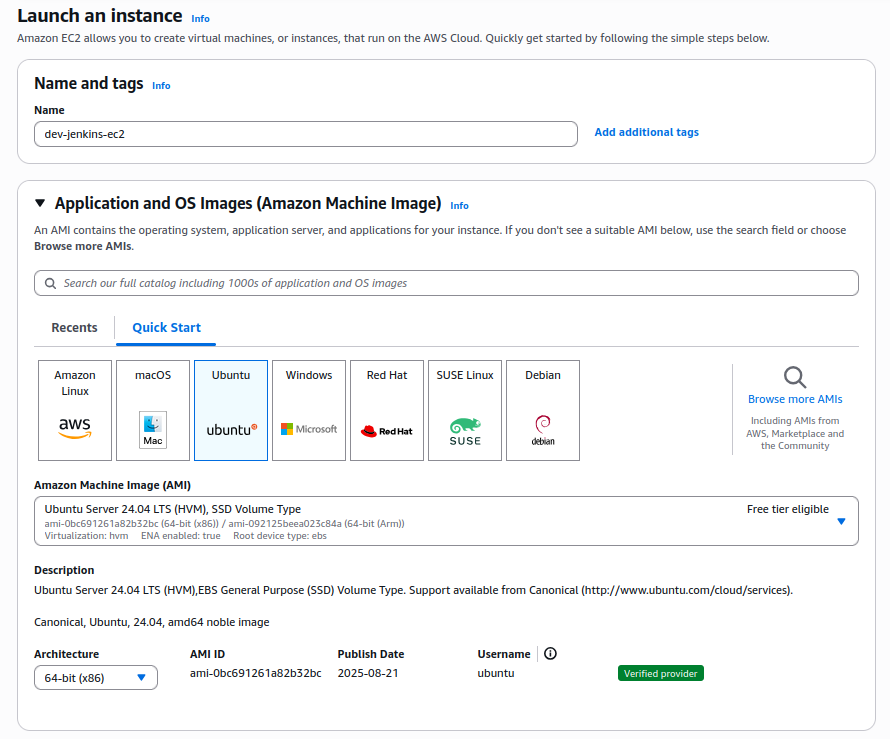
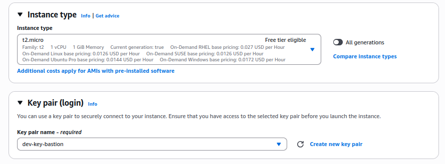
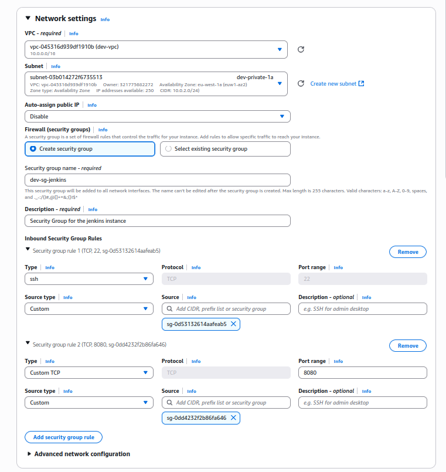
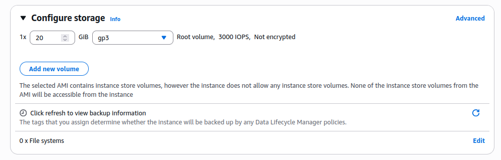
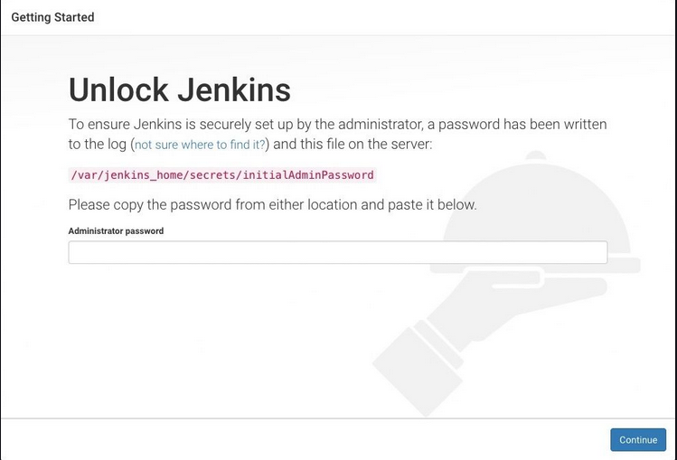

# Phase 2 - Step 1: EC2 Jenkins

## Objective

Create an instance and install jenkins in it.

---

## Requirements

- All the previous steps completed.
- Free Tier eligible AWS account.

---

## A. Launch the EC2 Instance

### 1. Go to the EC2 > **Instances**

From the AWS Console, open the EC2 service and click **Instances** from the left sidebar.

---

### 2. Click **Launch instances**

- **Instance name:** `dev-jenkins-ec2`

---

### 3. Choose AMI (Amazon Machine Image)

- Select: `Ubuntu Server 24.04 LTS (HVM), SSD Volume Type`



---   

### 4. Choose Instance Type

- Select: `t2.micro`

---

### 5. Create or Select Key Pair

-Use an existing key pair (`dev-key-bastion.pem`)



---

### 6. Network 

Click **Edit** in Network settings:
    - **VPC:** Select your custom VPC (`dev-vpc`)
    - **Subnet:** Select your private subnet with nat connection (`dev-private-1a`)
    - **Auto-assign Public IP:** **Disable**
    - **Firewall (Security Group):**
        - Choose an `Create a security group`
            -**Name:** `dev-sg-jenkins`
            -**Description:** `Security Group for the jenkins instance
            -**Inbound rules:**
| Type         | Protocol | Port Range | Source                               | Description            |
|--------------|----------|------------|--------------------------------------|------------------------|
| SSH          | TCP      | 22         | The SG of the bastion                |                        |

-**Outbound rules:**
| Type         | Protocol | Port Range | Destination         | Description        |
|--------------|----------|------------|---------------------|--------------------|
| Custom TCP   | TCP      | 8080       | The SG of the nginx |                    |



---

### 7. Configure Storage
    
- Select: 20GB SSD



---

### 8. Review and Launch

- Review everything, then click **Launch Instance**

---

### Connect to the Instance

After launching:

1. Connect to the bastion instance.
2. Go where you hace the `dev-key-bastion.pem` and connect to the private IP of the new instance.

```bash
ssh -i dev-key-bastion.pem ubuntu@<PRIVATE_IP>
```

## B. Install Jenkins

### 1. Install java

First of all, Jenkins requires Java to run, not all Java versions are compatible with Jenkins.
In this case we are installing OpenJDK-21.

```bash 
sudo apt update
sudo apt install fontconfig openjdk-21-jre
```

To verify if it is installed correctly:
```bash
java -version
openjdk version "21.0.3" 2024-04-16
OpenJDK Runtime Environment (build 21.0.3+11-Debian-2)
OpenJDK 64-Bit Server VM (build 21.0.3+11-Debian-2, mixed mode, sharing)
```

### 2. Install Jenkins

This is the Debian package repository of Jenkins to automate installation and upgrade. To use this repository, first add the key to your system.

```bash 
sudo wget -O /etc/apt/keyrings/jenkins-keyring.asc \
https://pkg.jenkins.io/debian-stable/jenkins.io-2023.key
```

Then add a Jenkins apt repository entry: 

```bash
echo "deb [signed-by=/etc/apt/keyrings/jenkins-keyring.asc]" \
https://pkg.jenkins.io/debian-stable binary/ | sudo tee \
/etc/apt/sources.list.d/jenkins.list > /dev/null
```

Update your local package index, then finally install Jenkins: 

```bash
sudo apt-get update
sudo apt-get install jenkins
```

### 3. Start Jenkins

You can enable the Jenkins service to start at boot with the command:

```bash
sudo systemctl enable jenkins
```

You can start the Jenkins service with the command:

```bash 
sudo systemctl start jenkins
```
You can check the status of the Jenkins service using the command:

```bash
sudo systemctl status jenkins
```
If everything has been set up correctly, you should see an output like this:

```bash
Loaded: loaded (/lib/systemd/system/jenkins.service; enabled; vendor preset: enabled)
Active: active (running) since Tue 2018-11-13 16:19:01 +03; 4min 57s ago
```

### 4. Unlock Jenkins

When you first access a new Jenkins controller, you are asked to unlock it using an automatically-generated password.

We don't have it installed locally, so we are gonna create a ssh tunnel, with this configuration on the ~/.ssh/config file.

> In the IdentityFile you are gona put the route to the .pem key of the bastion and the other one, so you need to have them
in your local machine.

```bash
Host bastion
    Hostname <PUBLIC_IP_BASTION>
    User ubuntu
    IdentityFile ~/.ssh/dev-key.pem

Host jenkins
    Hostname <PRIVATE_IP_JENKINS>
    User ubuntu
    IdentityFile ~/.ssh/dev-key-bastion.pem
    ProxyJump bastion
```

After this we put this command in a terminal

```bash
ssh -L 8080:localhost:8080 jenkins
```
> When you are into the jenkins instance after this command it indicates that the tunnel is up to use.

Now browse to http://localhost:8080 and wait until the Unlock Jenkins page appears.



Copy the console output of this command(auto-generated password)

```bash
sudo cat /var/lib/jenkins/secrets/initialAdminPassword
```
On the Unlock Jenkins page, paste this password into the Administrator password field and click Continue.

> This auto-generated password will be needed in the future to operate as an `admin`

### 5. Customize Jenkins plugins

After unlocking Jenkins, the Customize Jenkins page appears. Here you can install any number of useful plugins as part of your initial setup.


Click one of the two options shown:

**Install suggested plugins** - to install the recommended set of plugins, which are based on most common use cases.

**Select plugins to install** - to choose which set of plugins to initially install. When you first access the plugin selection page, the suggested plugins are selected by default.

> If you are not sure what plugins you need, choose Install suggested plugins. You can install (or remove) additional Jenkins plugins latter in time via the Manage Jenkins > Plugins page in Jenkins. 

### 6. Create the first admin user

After the plugins installation, Jenkins asks you to create your first administrator user.

- When the Create First Admin User page appears, specify the details for your admin user and click **Save and Finish.**
- When the Jenkins is ready page appears, click Start using Jenkins.
- If required, log in to Jenkins with the Admin user you just created.

> If the page does not automatically refresh, use the web brwoser to refresh the page.

## C. Configure the prefix

### 1. Go to /etc/default/jenkins

```bash
sudo nano /etc/default/jenkins
```
After the nano go to the end of the file and change the line that starts with JENKINS_ARGS.
Add `--prefix=$PREFIX` in the middle of the other arguments.

```bash
JENKINS_ARGS="--webroot=/var/cache/$NAME/war --prefix=/jenkins --httpPort=$HTTP_PORT"
```

And reload the service 
```bash
sudo systemctl reload jenkins.service
```

### 2. Edit the jenkins.service

Put this on the terminal

```bash
sudo systemctl edit jenkins.service
```

Add this line 
```bash
[Service]
Environment="JENKINS_PREFIX=/jenkins"
```
And reload the service
```bash
sudo systemctl reload jenkins.service
```
### 3. Add the nginx user to the jenkins group

With this command
```bash
sudo usermod -aG jenkins nginx
```

If you don't have a nginx user just type this command, instead of the above one
```bash
sudo usermod -aG jenkins www-data
```

### 4. Verify the correct configuration of the prefix

To verify it you can create a ssh tunnel with this command
```bash
ssh -L 8080:localhost:8080 jenkins
```
To check it search in your browser `http://localhost:8080/jenkins/`
If it takes you to the jenkins sign in page, the installation was succesful

## Terraform
[View Terraform(jenkins)](../../aws-infra/modules/jenkins/)

>⚠️ This instance is created with Terraform and automatically installs Java and Jenkins (service enabled and running on port 8080). **IMPORTANT:** Terraform does NOT perform the initial Jenkins unlock or create the admin user. You must do that manually as it is explained in the .md The "/jenkins" URL prefix and Nginx reverse-proxy configuration are also NOT handled by Terraform; these steps must be done manually following the steps.