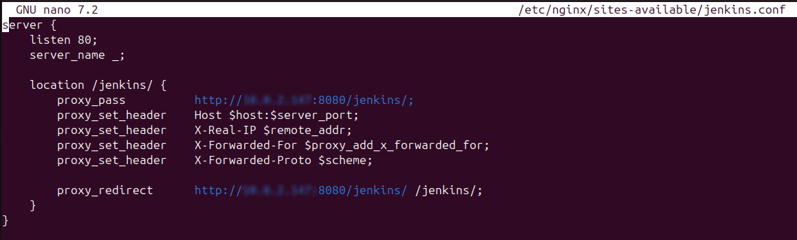
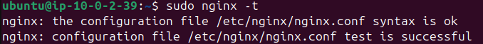
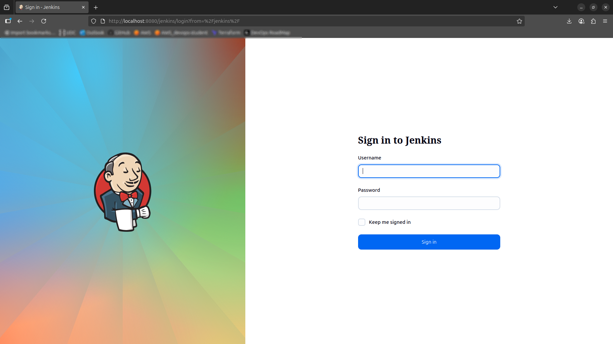

# Phase 2 - Step 2: Reverse Proxy(Nginx)

## Objective

Configure the Nginx server as a reverse proxy for the Jenkins instance.

---

## Requirements

- All the previous steps completed.
- Free Tier eligible AWS account.

---

## A. Create the configuration for the Jenkins  

Create or edit `/etc/nginx/sites-available/jenkins.conf`:
```bash
sudo nano /etc/nginx/sites-available/jenkins.conf
```

Add the following block (replace the private IP with your Jenkins private IP if different):
```bash
server {
    listen 80;
    server_name _; #It is a catch-all, it matches any hostname. So this block responds for any domain or IP

    location /jenkins/ { #Defines a location block for any request whose path starts with /jenkins/
        proxy_pass          http://<PRIVATE_IP_JENKINS>:8080/jenkins/; #Forwards the request to the Jenkins server running on the private IP at port 8080
        proxy_set_header    Host $host:$server_port; #Sends the original host name and port that the client requested (not the private IP).
        proxy_set_header    X-Real-IP $remote_addr; #Adds the client’s actual IP address so Jenkins can log the real source IP.
        proxy_set_header    X-Forwarded-For $proxy_add_x_forwarded_for; #Appends the client’s IP to the standard X-Forwarded-For header chain for proxies.
        proxy_set_header    X-Forwarded-Proto $scheme; #Informs Jenkins whether the original request was HTTP or HTTPS.

        proxy_redirect      http://<PRIVATE_IP_JENKINS>:8080/jenkins/ /jenkins/;
    }
}
```


## B. Enable the Configuration
Link the file to `sites-enabled`:

```bash
sudo ln -s /etc/nginx/sites-available/jenkins.conf /etc/nginx/sites-enabled/
```
## C. Test and Reload Nginx
Check syntax and reload:

```bash
sudo nginx -t        # Confirm configuration syntax
sudo systemctl reload nginx
```
If `nginx -t` shows **syntax is ok** and **test is succesfull**, everythings good.



## D. Verify from Your Local Machine
Because the Nginx EC2 instance is in a private subnet, create an SSH tunnel.
Update your `~/.ssh/config` with the appropriate keys and hosts:
```bash
Host bastion
    Hostname <PUBLIC_IP_BASTION>
    User ubuntu
    IdentityFile ~/.ssh/dev-key.pem

Host jenkins
    Hostname <PRIVATE_IP_JENKINS>
    User ubuntu
    IdentityFile ~/.ssh/dev-key-bastion.pem
    ProxyJump bastion

Host nginx
  HostName <PRIVATE_IP_NGINX>
  User ubuntu
  IdentityFile ~/.ssh/dev-key-bastion.pem
  ProxyJump bastion
```
Start the tunnel:

```bash
ssh -L 8080:localhost:80 nginx
```
> When you are into the nginx instance after this command it indicates that the tunnel is up to use.

This forwards local port 8080 to Nginx port 80 through the bastion.

Now browse to http://localhost:8080/jenkins/ and wait until the sign in Jenkins page appears.
s
If the Jenkins sign in page appears it indicates that the configuration was good, you can now sign in
as the admin user we created in the previous step.

