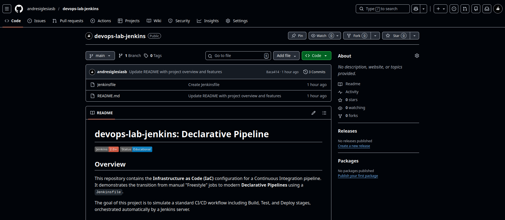
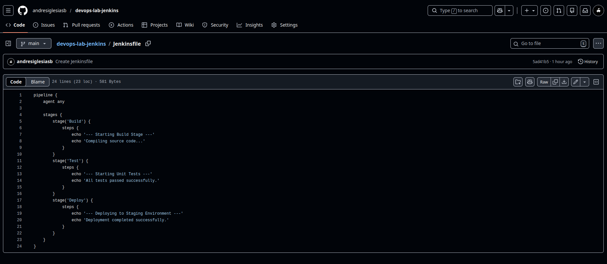
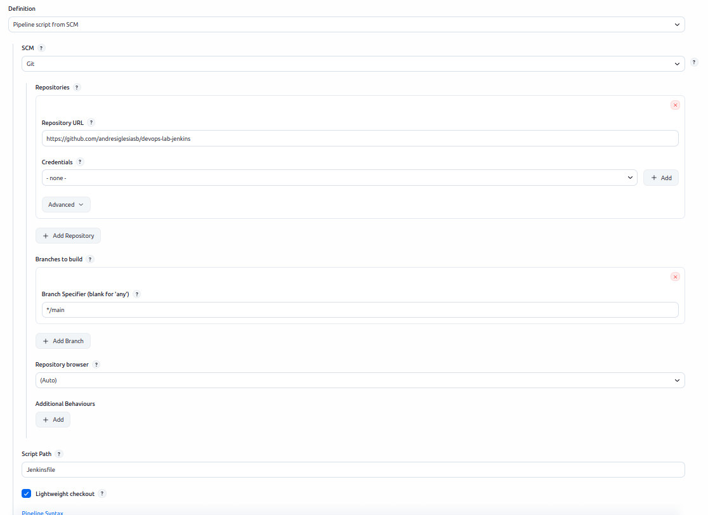
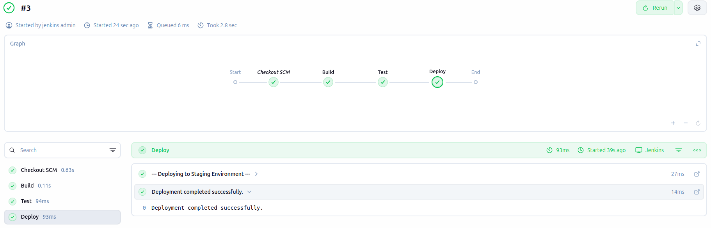
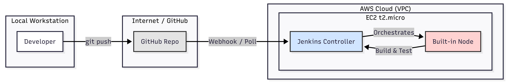
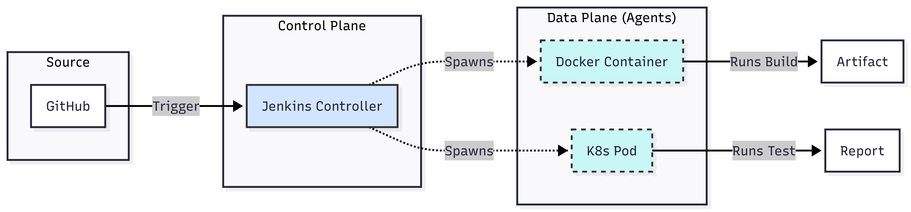

## Objective
Implement a "Pipeline as Code" workflow. Instead of manually configuring steps in the Jenkins UI, we will define the build, test, and deploy logic in a `Jenkinsfile` stored in a GitHub repository.

---

## Requirements

- Jenkins installed and running (from previous steps).
- A GitHub account.
- Connectivity between Jenkins (via NAT/IGW) and public Internet.

---

## A. GitHub Repository Setup

### 1. Create the Repository

- Go to GitHub and create a new **Public** repository named `devops-lab-jenkins`.

- *Note: We use a public repo for this initial test to avoid complex authentication setup, simplifying the connectivity check.*



### 2. Create the Jenkinsfile

- Create a new file in the root of the repository named `Jenkinsfile` (Case sensitive, no extension).

- Paste the following **Declarative Pipeline** code:
```groovy

pipeline { agent any

    stages {
        stage('Build') {
            steps {
                echo '--- Starting Build Stage ---'
                echo 'Compiling source code...'
            }
        }
        stage('Test') {
            steps {
                echo '--- Starting Unit Tests ---'
                echo 'All tests passed successfully.'
            }
        }
        stage('Deploy') {
            steps {
                echo '--- Deploying to Staging Environment ---'
                echo 'Deployment completed successfully.'
            }
        }
    }
} 
```



---

## B. Configure Jenkins Job

### 1. Create New Item

- **Item Name:** `Primer-Pipeline-Code`
- **Type:** `Pipeline` (Crucial: Do not select Freestyle)

### 2. Configure SCM (Source Code Management)
Scroll down to the **Pipeline** section:
- **Definition:** `Pipeline script from SCM`
- **SCM:** `Git`
- **Repository URL:** `https://github.com/<YOUR_USER>/devops-lab-jenkins.git`
- **Branch Specifier:** `*/main` (Ensure this matches your GitHub default branch)
- **Script Path:** `Jenkinsfile`



---

## C. Execution and Verification
### 1. Build Now
- Click **Build Now** on the left menu.
- Observe the **Stage View**. You should see three green checks corresponding to our stages: Build, Test, and Deploy.



---

## D. Architecture Analysis
### 1. Current Architecture (Single Node)
In this lab, we are running the workloads directly on the Jenkins Controller (Master).
**Why this approach?**
We are applying **FinOps principles** to our learning path. To minimize AWS costs, we utilize the existing `t2.micro` instance for both orchestration and execution. While not recommended for heavy production loads, it is sufficient for learning the syntax and flow of pipelines without provisioning extra EC2 instances.

### 2. Ideal Production Architecture (Distributed)
In a real-world scenario, executing jobs on the Controller is a security risk and performance bottleneck. The standard architecture uses **Distributed Agents**.
- **Controller:** Only manages users, scheduling, and plugins.
- **Agents:** Ephemeral servers (or containers) that execute the actual heavy lifting (Build, Test).

*We will move closer to this architecture in Phase 3 by integrating Kubernetes.*