# Phase 3 - Containers and Kubernetes (Jenkins Integration)

## Objective
Introduce Docker, Kubernetes, and CI/CD with Jenkins, maintaining the exposure of services through the NGINX reverse proxy already deployed and published by the ALB. This phase connects all the concepts learned so far and brings us closer to a real-world CI/CD workflow.

---

## Architecture Overview

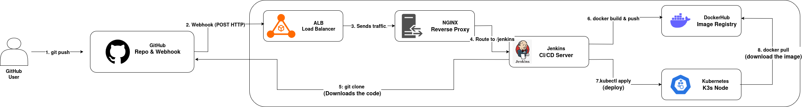

## CI/CD Pipeline Flow

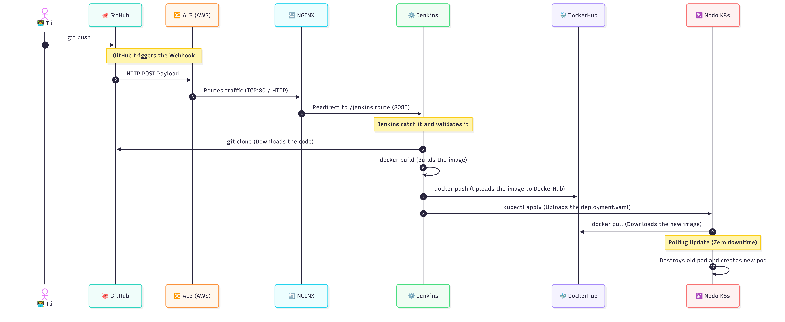

---

## Requirements
- Jenkins installed and running (from Phase 2).
- A GitHub account and a DockerHub account.
- Base AWS Infrastructure (VPC, Subnets, Bastion Host, NGINX, ALB).

---

## A. AWS Kubernetes Environment Preparation

### 1. Configure Security Group

**Path:** `EC2 → Security Groups → Create security group`

1. Click on **Create security group**
    - **Security group name:** `dev-sg-k8s`
    - **Description:** Allows SSH from Bastion, Kubernetes API for Jenkins, and NodePort services for NGINX
    - **VPC:** Select `dev-vpc` (created earlier)
    - **Inbound rules:** 

    | Type         | Protocol | Port Range | Source                               | Description            |
    |--------------|----------|------------|--------------------------------------|------------------------|
    | SSH          | TCP      | 22         | Bastion SG                           | For SSH access only    |
    | Custom TCP   | TCP      | 6443       | dev-vpc CIDR (10.0.0.0/16)          | Kubernetes API         |
    | Custom TCP   | TCP      | 30000-32767| dev-vpc CIDR (10.0.0.0/16)          | NodePort Services      |
    - **Outbound rules:** Let the default rule (All traffic allowed)

2. Click on `Create security group`

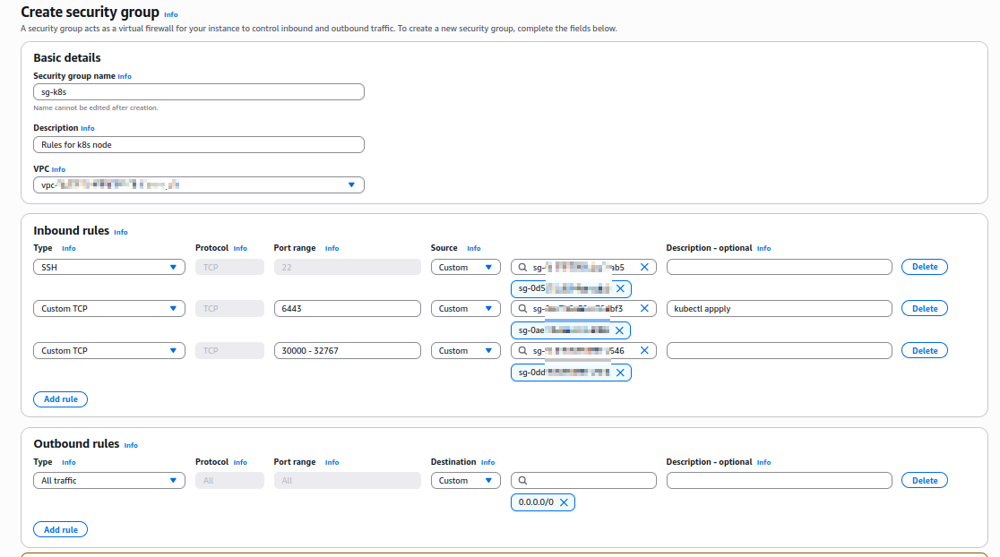

### 2. Launch the EC2 Instance (K8s Node)
- Deployed a new EC2 instance in the private subnet.
- Used the Ubuntu 24.04 AMI and selected the `t2.small` instance type, which is recommended to provide enough memory for K3s to run smoothly.
- Attached the `sg-k8s` Security Group and provisioned a 14 GiB root volume.

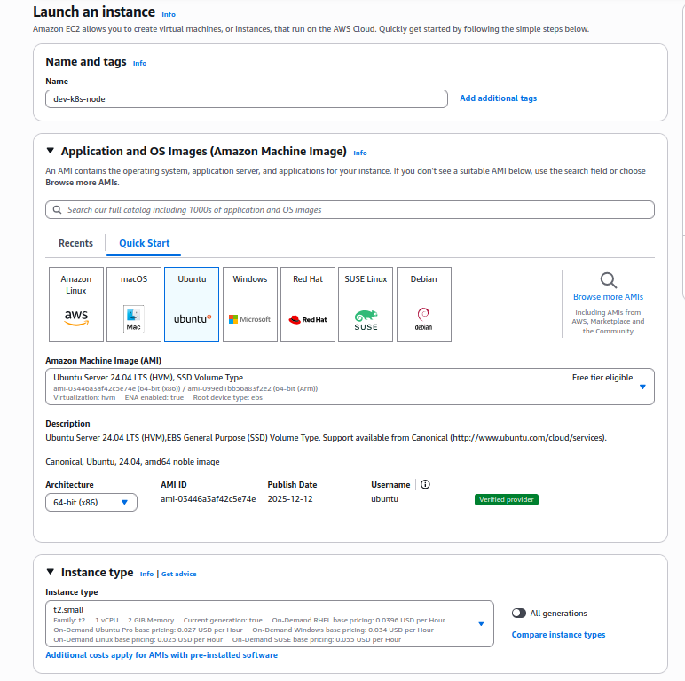
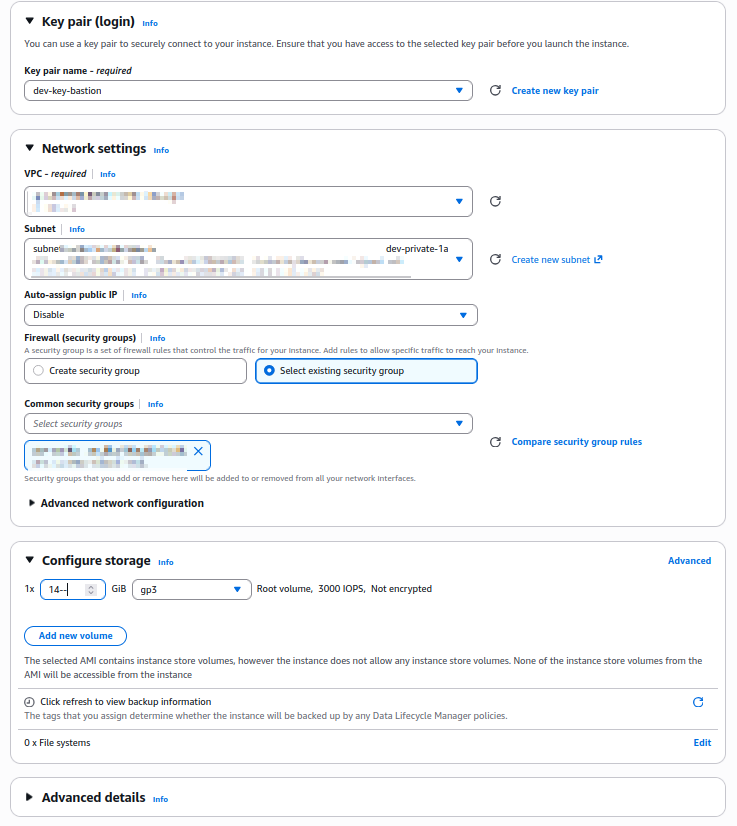

#### Terraform equivalent

```hcl
resource "aws_instance" "k8s" {
  ami                    = "ami-068d350220f3c26e3"  # Ubuntu 22.04 LTS custom AMI with K3s pre-installed
  instance_type          = "t2.small"
  key_name               = "dev-key-bastion"
  subnet_id              = var.dev_private_subnet_id_1a
  associate_public_ip_address = false
  vpc_security_group_ids = [var.k8s_sg_id]

  tags = merge(
    var.common_tags,
    {
      Name = "dev-k8s-ec2"
    }
  )
  
  root_block_device {
    volume_size           = 14
    volume_type           = "gp3"
    delete_on_termination = true
  }
}
```

> **Note:** K3s and additional configurations are pre-installed in the custom AMI image. Terraform handles only infrastructure provisioning.

### 3. Configure SSH Access
- Updated the `~/.ssh/config` file on our local machine to include the new `k8s` host.
- Used the `ProxyJump bastion` directive to securely access the private instance, just as we did with Jenkins and NGINX.

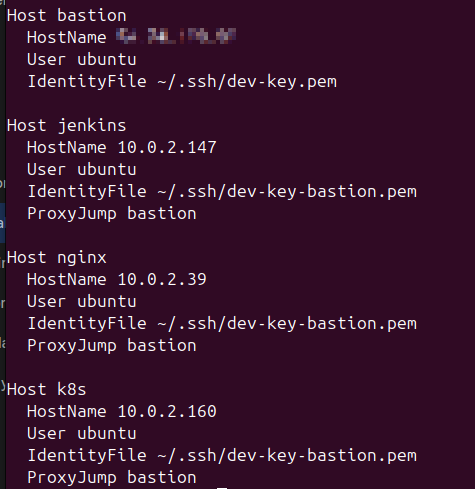

---

## B. Kubernetes Setup & Jenkins Connectivity

### 1. Validate the Cluster
- After installing K3s on the instance, we verified that the node is running correctly.
- Validated the node status using the `kubectl get nodes` command. It should appear in a `Ready` state.

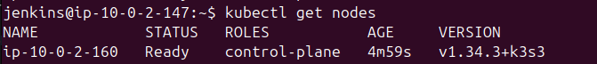

### 2. Jenkins -> Kubernetes Connectivity
- Installed `kubectl` on the Jenkins server.
- Copied the K3s cluster configuration file and saved it to `/var/lib/jenkins/.kube/config`.
- Configured the `server` parameter to point to the private IP of our K8s node (`https://<PRIV_IP>:6443`).

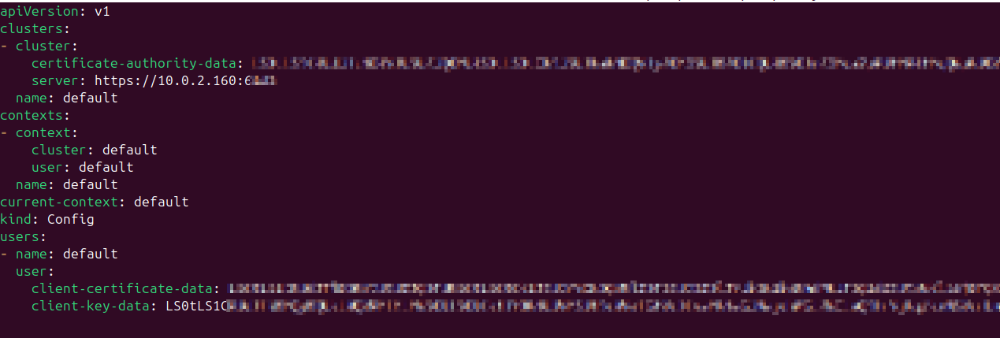

### 3. Manual Deployment Test
- Performed a manual test to ensure Jenkins can communicate with the K8s API.
- Created a `devops-lab` namespace, deployed a simple `nginx:alpine` image, and exposed a NodePort service on port `30080`.

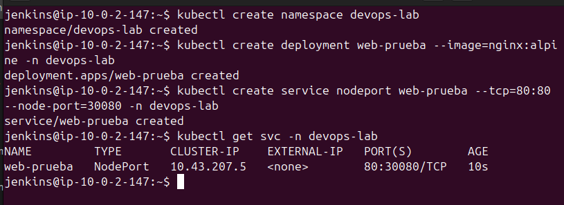

- After validating the creation, we cleaned up the environment by deleting the manual deployment and service to prepare for pipeline automation.

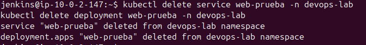

---

## C. Code and Image Repositories

### 1. GitHub Repository
- Created a private repository on GitHub named `devops-lab-phase3`.
- Added an `index.html` file containing a simple web application that will serve as our sample app.

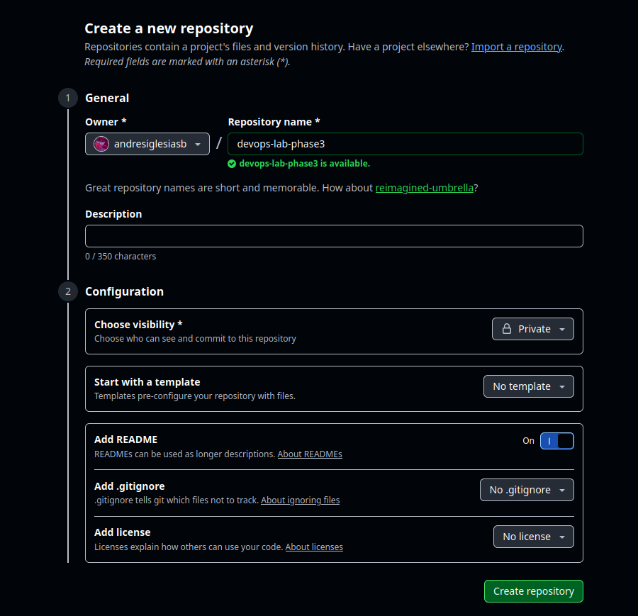
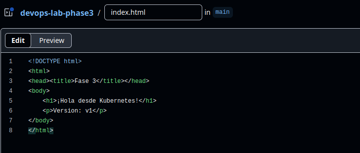

### 2. DockerHub Repository
- Ensured a DockerHub repository (`andresiglesiasbarbara/fase3-app`) was ready to store the Docker images built by Jenkins.

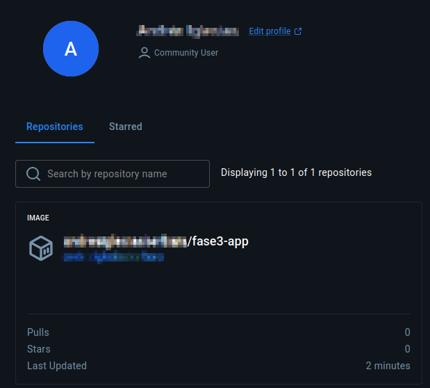

### 3. GitHub Webhook Configuration

**Path:** `GitHub Repository → Settings → Webhooks → Add webhook`

1. Navigate to your GitHub repository (`devops-lab-phase3`)
2. Click on **Settings** → **Webhooks** → **Add webhook**
3. Configure the webhook with the following details:
    - **Payload URL:** `http://<Jenkins-Public-IP>:8080/github-webhook/`
    - **Content type:** `application/json`
    - **Events:** Select **Just the push event** (or **Send me everything** for full event coverage)
    - **Active:** Check the box to enable the webhook
4. Click **Add webhook**

This webhook will automatically trigger the Jenkins pipeline whenever you push changes to the GitHub repository.

---

## D. Jenkins Pipeline Configuration

### 1. Credentials Management
- Navigated to *Manage Jenkins > Credentials* to keep our secrets secure.
- Added *Username with password* credentials for both our private GitHub repository and our DockerHub account.

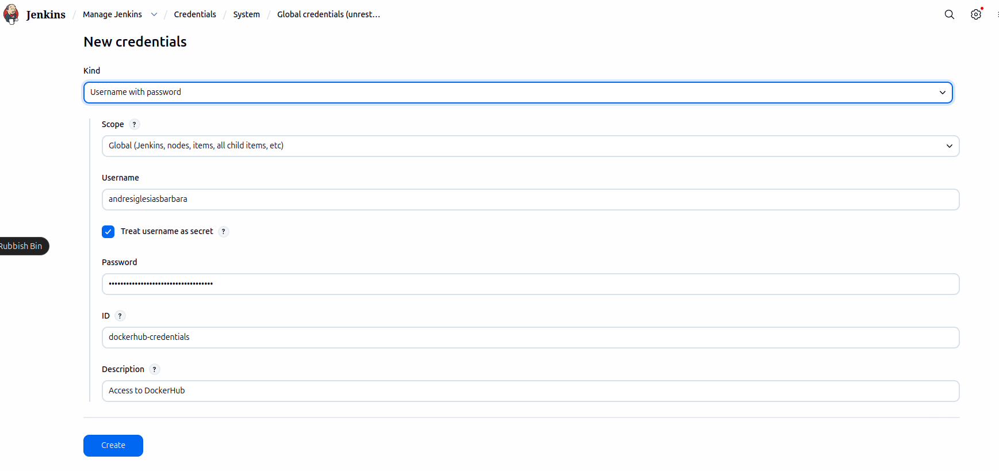
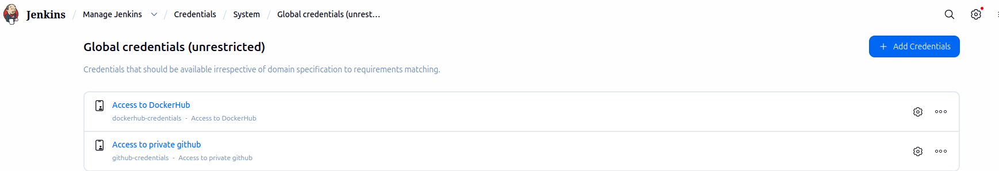

### 2. Pipeline Job Creation
- Created a new item in Jenkins.
- **Item Name:** `K8s-CI-CD`
- **Type:** `Pipeline`. This will allow us to clone the GitHub repo, build the Docker image, push it to DockerHub, and execute the deployment in Kubernetes.

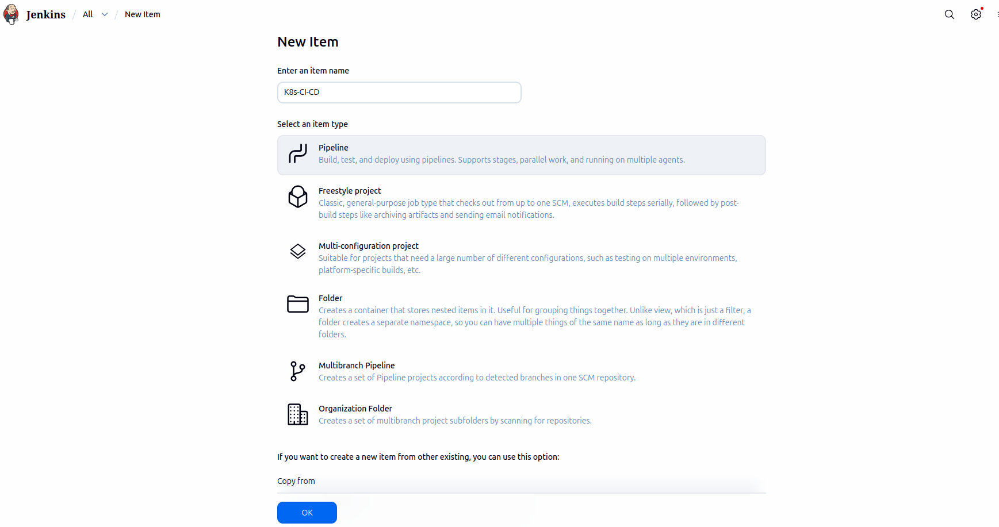

### 3. Pipeline as Code (Jenkinsfile)
To fully automate our deployment, we created a declarative `Jenkinsfile` in the root of our repository. This script defines three main stages:

1. **Build Docker:** Compiles the Docker image and tags it dynamically using the Jenkins Build Number to ensure version control (e.g., `v1`, `v2`).
2. **Upload to DockerHub:** Authenticates against the Docker registry using Jenkins credentials and pushes the newly built image.
3. **Deploy in K8s:** Ensures the `devops-lab` namespace exists, dynamically updates the `deployment.yaml` with the new image tag using `sed`, and applies the manifests directly to the cluster (`kubectl apply -f k8s/`).

<details>
<summary>Click to view the Jenkinsfile code</summary>

```groovy
pipeline {
    agent any
    
    environment {
        DOCKER_IMAGE = 'XXXXXXXXXXXXXX/fase3-app'
        TAG = "v${BUILD_NUMBER}"
        DOCKER_CREDS = 'dockerhub-credentials'
    }

    stages {
        stage('Construir Docker') {
            steps {
                script {
                    docker.build("${DOCKER_IMAGE}:${TAG}")
                    docker.build("${DOCKER_IMAGE}:latest")
                }
            }
        }
        
        stage('Subir a DockerHub') {
            steps {
                script {
                    docker.withRegistry('', DOCKER_CREDS) {
                        docker.image("${DOCKER_IMAGE}:${TAG}").push()
                        docker.image("${DOCKER_IMAGE}:latest").push()
                    }
                }
            }
        }

        stage('Desplegar en K8s') {
            steps {
                script {
                    sh "kubectl create namespace devops-lab || true"
                    sh "sed -i 's|image: .*|image: ${DOCKER_IMAGE}:${TAG}|' k8s/deployment.yaml"
                    sh "kubectl apply -f k8s/"
                }
            }
        }
    }
}
``` 
</details>

---

## E. Execution & Verification

### 1. NGINX Integration
- To access the app externally, we added a `location /app/` block in the NGINX configuration that redirects traffic to the Kubernetes NodePort.
- After successfully running the pipeline, we accessed our Application Load Balancer URL at the `/app/` path.
- Verified external access and confirmed the web application correctly loads the "¡Hola desde Kubernetes!" message.

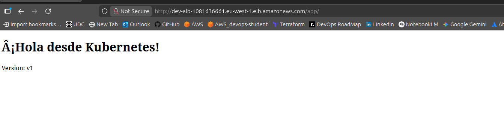

---

## F. Terraform Configuration

To automate the infrastructure deployment, Terraform modules have been created to manage the K8s node and its security group configuration.

### 1. Security Group Module

The security group is managed in the `security-groups` module with the following configuration saved in `sg_k8s.tf`:

**File:** `aws-infra/modules/security-groups/sg_k8s.tf`

```hcl
resource "aws_security_group" "k8s" {
  name        = "dev-sg-k8s"
  description = "Allows SSH from Bastion, Kubernetes API for Jenkins, and NodePort services for NGINX"
  vpc_id      = var.vpc_id

  ingress {
    description     = "SSH from Bastion"
    from_port       = 22
    to_port         = 22
    protocol        = "tcp"
    security_groups = [aws_security_group.bastion.id]
  }

  ingress {
    description = "Kubernetes API (from VPC - Jenkins access)"
    from_port   = 6443
    to_port     = 6443
    protocol    = "tcp"
    cidr_blocks = ["10.0.0.0/16"]
  }

  ingress {
    description = "NodePort services from VPC"
    from_port   = 30000
    to_port     = 32767
    protocol    = "tcp"
    cidr_blocks = ["10.0.0.0/16"]
  }

  egress {
    from_port   = 0
    to_port     = 0
    protocol    = "-1"
    cidr_blocks = ["0.0.0.0/0"]
  }

  tags = merge(
    var.common_tags,
    {
      Name = "dev-sg-k8s"
    }
  )
}
```

### 2. K8s Module

A new module has been created to manage the Kubernetes EC2 instance. The module is located in `aws-infra/modules/k8s/`.

```hcl

  key_name               = "dev-key-bastion"
  subnet_id              = var.dev_private_subnet_id_1a
  associate_public_ip_address = false
  vpc_security_group_ids = [var.k8s_sg_id]

  tags = merge(
    var.common_tags,
    {
      Name = "dev-k8s-ec2"
    }
  )
  
  root_block_device {
    volume_size           = 14
    volume_type           = "gp3"
    delete_on_termination = true
  }
}
```

### 3. Module Integration in main.tf

The K8s module is integrated into the main Terraform configuration:

**File:** `aws-infra/main.tf`

```hcl
module "k8s" {
    source = "./modules/k8s"
    k8s_sg_id = module.security-groups.k8s_sg_id
    dev_private_subnet_id_1a = module.vpc.dev_private_subnet_id_1a

    providers = {
        aws = aws.perfil-network
    }

    common_tags = local.tags_phase1
}
```

### 4. Deploy using Terraform

Once you have built the AMI with Packer and updated the `ami` variable in `main.tf`, deploy the infrastructure from the `aws-infra` directory:

```bash
cd aws-infra
terraform plan
terraform apply
```

This will launch the K3s EC2 instance with K3s already pre-installed and ready to use.

---

## G. Architecture & Methodology Analysis

### 1. CI/CD Flow Summary
By completing this phase, we have established a full CI/CD loop: **GitHub (Private Repo) → Jenkins (Pipeline) → Build Docker → Push to DockerHub → Deploy to Kubernetes → Expose via NGINX → ALB**.

### 2. Architectural Decisions & Trade-offs
In a real-world production environment, some of the configurations applied in this lab would be considered anti-patterns. We have deliberately chosen them for educational and FinOps purposes:

* **Single Node vs. High Availability (HA) Cluster:** We are currently using a single `t2.small` EC2 instance to run Kubernetes. Production clusters require High Availability (at least 3 Control Plane nodes and multiple Worker nodes distributed across Availability Zones) to prevent a Single Point of Failure (SPOF). However, applying **FinOps principles**, we chose a single node to minimize AWS billing costs while still mastering core Kubernetes concepts.
* **CIOps (Push Model) vs. GitOps (Pull Model):** Currently, our Jenkins pipeline executes `kubectl apply` directly against the cluster. This is known as a "Push" model or CIOps. While excellent for learning the fundamentals of Kubernetes manifests and CLI commands ("The Hard Way"), it poses security risks (giving Jenkins full cluster admin rights) and can lead to configuration drift if someone modifies the cluster manually. In future phases, we will evolve to a **GitOps** approach (using tools like ArgoCD or Flux), where an agent inside the cluster *pulls* the desired state from Git, ensuring the cluster is always an exact replica of the repository.