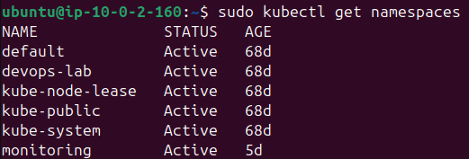
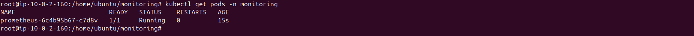

# Phase 4 - Step 1: Prometheus

## Objective

Install Prometheus manually on the Kubernetes cluster to collect and store metrics from all running workloads.

---

## Requirements

- K3s cluster running and accessible via `kubectl`.
- `monitoring` namespace created.

---

## A. Create the Namespace

```bash
kubectl create namespace monitoring
kubectl get namespaces
```



---

## B. Download Official Manifests

```bash
wget https://raw.githubusercontent.com/prometheus/prometheus/main/documentation/examples/prometheus-kubernetes.yml
cat prometheus-kubernetes.yml
```

> This file serves as the reference for the scrape configuration used in the ConfigMap below.

---

## C. Apply RBAC

Prometheus needs read access to the Kubernetes API to discover pods and nodes.

```bash
kubectl apply -f prometheus-deployment.yaml
```

Resources created:
- `ServiceAccount` — identity for the Prometheus pod
- `ClusterRole` — permissions to list/watch pods, nodes, endpoints
- `ClusterRoleBinding` — binds the role to the service account

---

## D. Apply ConfigMap

The ConfigMap holds `prometheus.yml` with the scrape configuration and `alert_rules.yml` with the alert definitions.

**Scrape jobs configured:**
| Job | Target |
|-----|--------|
| `prometheus` | `localhost:9090` |
| `node-exporter` | `node-exporter:9100` |
| `kubernetes-pods` | Auto-discovered via kubernetes_sd |

**Alert rules defined:**
| Alert | Condition |
|-------|-----------|
| `HighCPUUsage` | CPU > 80% for 2 minutes |
| `HighMemoryUsage` | Memory > 80% for 2 minutes |
| `NodeExporterDown` | node-exporter unreachable for 1 minute |

---

## E. Apply Deployment and Service

- **Image:** `prom/prometheus:v2.52.0`
- **Port:** `9090`
- **Retention:** 7 days
- **Service type:** `ClusterIP` (internal only)

```bash
kubectl get svc -n monitoring
kubectl get pods -n monitoring
```



---

## F. Validate

```bash
kubectl port-forward -n monitoring svc/prometheus 9095:9090 &
sleep 2
curl -s http://localhost:9095/api/v1/rules
pkill -f "port-forward"
```


> [!NOTE]
> - The `kubernetes-pods` job uses pod annotations to auto-discover scrape targets. Any pod with `prometheus.io/scrape: "true"` will be automatically included.
> - Storage uses `emptyDir` — metrics are lost on pod restart. For production, use a `PersistentVolume`.
