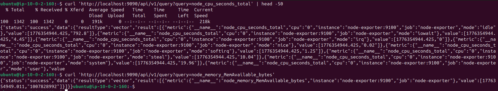

# Phase 4 - Step 2: Node Exporter

## Objective

Deploy Node Exporter as a DaemonSet to expose OS-level metrics (CPU, memory, disk, network) from the Kubernetes node to Prometheus.

---

## Requirements

- Prometheus running in the `monitoring` namespace.
- `monitoring` namespace exists.

---

## A. Create the DaemonSet

Node Exporter runs as a `DaemonSet` — one pod per node — with access to the hosts `/proc`, `/sys` and `/` filesystems.

Key settings:
- `hostPID: true` — access to host process IDs
- `hostNetwork: true` — uses the host network directly
- `hostPort: 9100` — exposes metrics on the node's IP

```bash
kubectl apply -f node-exporter.yaml
kubectl get daemonset -n monitoring
kubectl get pods -n monitoring
```

---

## B. Expose Port 9100

A headless `ClusterIP: None` Service is created so Prometheus can resolve `node-exporter:9100` via DNS within the cluster.

```bash
kubectl get svc -n monitoring
```

---

## C. Verify Prometheus is Scraping

The `node-exporter` scrape job was already defined in the Prometheus ConfigMap in Step 1. Verify the metrics are flowing:

```bash
kubectl port-forward -n monitoring svc/prometheus 9095:9090 &
sleep 2
curl -s 'http://localhost:9095/api/v1/query?query=node_memory_MemAvailable_bytes'
pkill -f "port-forward"
```

---

## D. Verify CPU and Memory Metrics

```bash
kubectl port-forward -n monitoring svc/prometheus 9090:9090 &
sleep 2

# CPU usage %
curl -s 'http://localhost:9090/api/v1/query?query=100-(avg(irate(node_cpu_seconds_total' | head -50


# Memory usage %
curl -s 'http://localhost:9090/api/v1/query?query=node_memory_MemAvailable_bytes'

pkill -f "port-forward"
```



---

> [!NOTE]
> Node Exporter uses `hostNetwork: true`, which means it binds directly to the node's network interface. This avoids the need for a NodePort service and ensures Prometheus can always reach it at `node-exporter:9100`.
