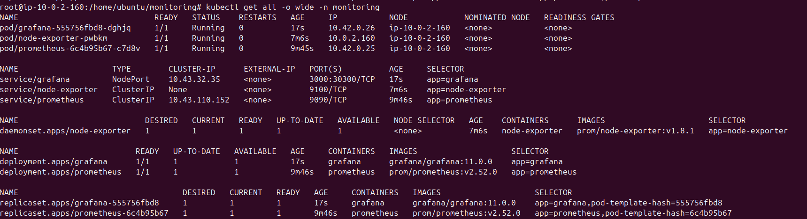
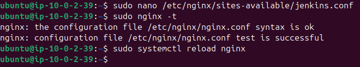
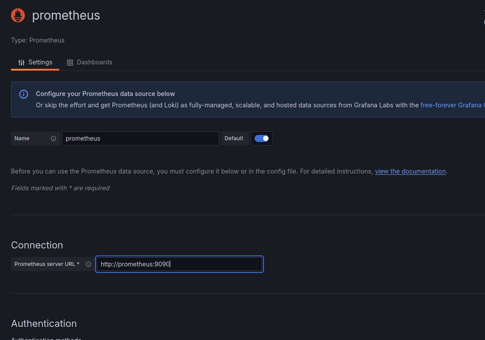
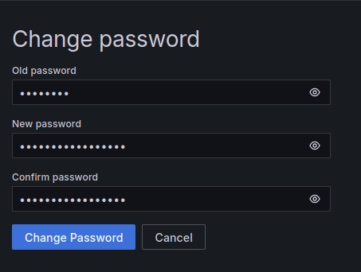
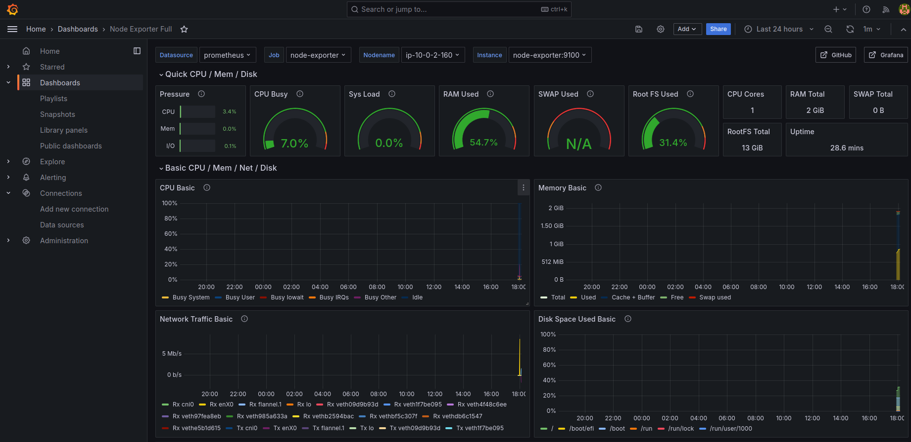

# Phase 4 - Step 3: Grafana

## Objective

Deploy Grafana manually, configure Prometheus as a data source, create a dashboard with CPU, memory, requests and latency metrics, and expose it through the existing NGINX reverse proxy at `/grafana`.

---

## Requirements

- Prometheus and Node Exporter running in the `monitoring` namespace.
- NGINX EC2 instance accessible via bastion.

---

## A. Deploy Grafana

- **Image:** `grafana/grafana:11.0.0`
- **Port:** `3000`
- **Service type:** `NodePort 30300`

```bash
kubectl apply -f grafana.yaml
kubectl get pods -n monitoring
kubectl get svc -n monitoring
```



---

## B. Expose Grafana via NGINX at `/grafana`

Connect to the NGINX EC2 instance from the bastion:

```bash
ssh -i dev-key-bastion.pem ubuntu@<NGINX_PRIVATE_IP>
sudo nano /etc/nginx/sites-available/jenkins.conf
```

Add the following block inside the `server {}` block, after the `/jenkins/` location:

```nginx
location /grafana/ {
    proxy_pass          http://<K8S_PRIVATE_IP>:30300/grafana/;
    proxy_set_header    Host $host;
    proxy_set_header    X-Real-IP $remote_addr;
    proxy_set_header    X-Forwarded-For $proxy_add_x_forwarded_for;
    proxy_set_header    X-Forwarded-Proto $scheme;
}
```

```bash
sudo nginx -t
sudo systemctl reload nginx
```



Grafana is now accessible at: `http://<ALB_DNS>/grafana/`

---

## C. Configure Prometheus as Data Source

1. Open `http://<ALB_DNS>/grafana/` — login with `admin` / `admin123`
2. Go to `Connections` → `Data Sources` → `Add data source`
3. Select **Prometheus**
4. Set URL: `http://prometheus:9090`
5. Click `Save & test`



6. (Optional) Change password: Click your user icon and change password, fill it.



---

## D. Create Dashboard

1. Go to `Dashboards` → `New` → `Import`
2. Enter ID `1860` (Node Exporter Full)
3. Click `Load` → select the Prometheus data source → `Import`

The dashboard includes panels for:
- CPU usage per core
- Memory available
- Disk I/O
- Network traffic



---

> [!NOTE]
> - Default credentials are `admin` / `admin123`. Change the password after first login in a real environment.
> - Grafana uses `emptyDir` for storage — dashboards and data sources are lost on pod restart. For production, use a `PersistentVolume` or provision them via ConfigMaps.
