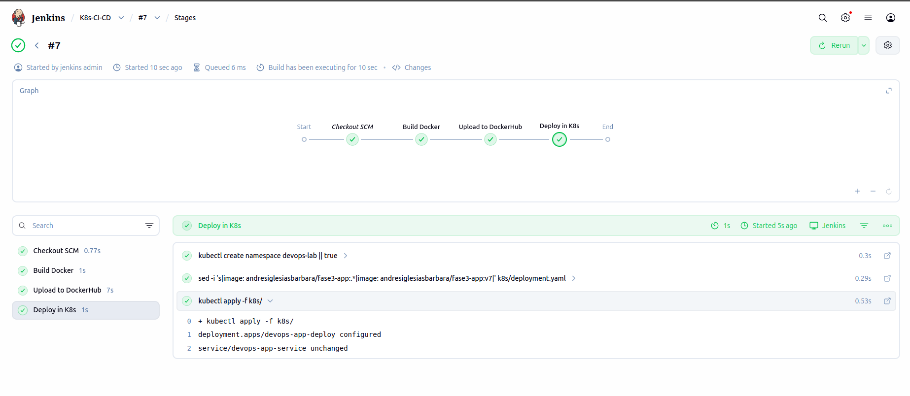
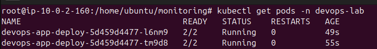
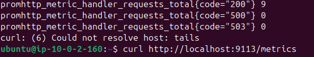
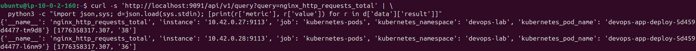

# Phase 4 - Step 4: App Instrumentation

## Objective

Instrument the existing nginx-based application to expose Prometheus metrics, allowing Prometheus to automatically discover and scrape request counts and connection data.

---

## Requirements

- Application running in the `devops-lab` namespace.
- Prometheus running with `kubernetes-pods` scrape job configured.

---

## A. Architecture

The application is a static HTML page served by nginx. Since nginx does not natively expose Prometheus metrics, a **sidecar pattern** is used:

```
Pod
├── contenedor-web   (nginx — serves HTML on :80, stub_status on :8081)
└── nginx-exporter   (nginx-prometheus-exporter — exposes /metrics on :9113)
```

Prometheus scrapes the sidecar at `:9113/metrics` and gets nginx-level metrics.

---

## B. Add nginx stub_status

Create `nginx.conf` in the app repository root:

```nginx
server {
    listen 80;
    location / {
        root   /usr/share/nginx/html;
        index  index.html;
    }
}

server {
    listen 8081;
    location /stub_status {
        stub_status on;
        access_log  off;
        allow       127.0.0.1;
        deny        all;
    }
}
```

> Port `8081` only accepts connections from `127.0.0.1` — the sidecar running in the same pod.

---

## C. Update Dockerfile

```dockerfile
FROM nginx:alpine

COPY index.html /usr/share/nginx/html/index.html
COPY nginx.conf /etc/nginx/conf.d/default.conf

EXPOSE 80
```

---

## D. Update Kubernetes Deployment

**`k8s/deployment.yaml`** — adds pod annotations for Prometheus autodiscovery and the `nginx-exporter` sidecar:

```yaml
template:
  metadata:
    annotations:
      prometheus.io/scrape: "true"
      prometheus.io/port:   "9113"
      prometheus.io/path:   "/metrics"
  spec:
    containers:
      - name: contenedor-web
        image: andresiglesiasbarbara/fase3-app:latest
        ports:
          - containerPort: 80
          - containerPort: 8081

      - name: nginx-exporter
        image: nginx/nginx-prometheus-exporter:1.1.0
        args:
          - "--nginx.scrape-uri=http://localhost:8081/stub_status"
        ports:
          - containerPort: 9113
```

---

## E. Fix Jenkinsfile sed Command

The original `sed` replaced **all** `image:` lines in the YAML, which would overwrite the sidecar image on each build. Updated to only replace the application image:

```groovy
// Before (breaks with sidecar):
sh "sed -i 's|image: .*|image: ${DOCKER_IMAGE}:${TAG}|' k8s/deployment.yaml"

// After (only replaces the app image):
sh "sed -i 's|image: ${DOCKER_IMAGE}:.*|image: ${DOCKER_IMAGE}:${TAG}|' k8s/deployment.yaml"
```

---

## F. Deploy and Verify

Push the changes to GitHub — Jenkins will build, push to DockerHub and deploy automatically.



```bash
# Pods should show READY 2/2 (main container + sidecar)
kubectl get pods -n devops-lab
```



```bash
# Verify metrics endpoint directly
kubectl port-forward -n devops-lab deployment/devops-app-deploy 9113:9113 &
sleep 2
curl http://localhost:9113/metrics
pkill -f "port-forward"
```



---

## G. Verify Prometheus is Scraping

```bash
kubectl port-forward -n monitoring svc/prometheus 9095:9090 &
sleep 2
curl -s 'http://localhost:9095/api/v1/query?query=nginx_http_requests_total' | \
  python3 -c "
import json,sys
d=json.load(sys.stdin)
r=d['data']['result']
print('Targets found:', len(r))
for t in r:
    print(' -', t['metric'].get('kubernetes_namespace',''), t['value'][1], 'requests')
"
pkill -f "port-forward"
```



---

## Metrics Available

| Metric | Description |
|--------|-------------|
| `nginx_http_requests_total` | Total HTTP requests handled |
| `nginx_connections_active` | Currently active connections |
| `nginx_connections_accepted` | Total accepted connections |
| `nginx_connections_handled` | Total handled connections |
| `nginx_connections_reading` | Connections currently reading |
| `nginx_connections_writing` | Connections currently writing |
| `nginx_connections_waiting` | Keep-alive connections waiting |

---

## Notes

> The sidecar reads `stub_status` every 5 seconds (default). The `stub_status` module is included in all nginx distributions — no additional packages needed.
