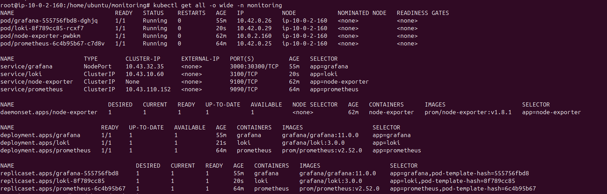
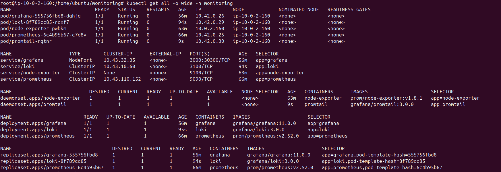
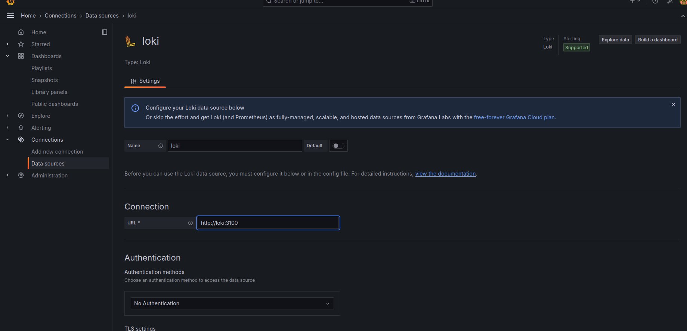
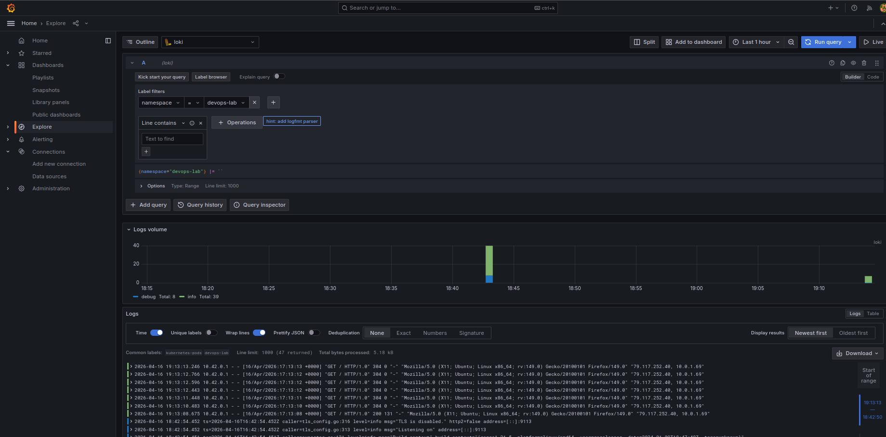
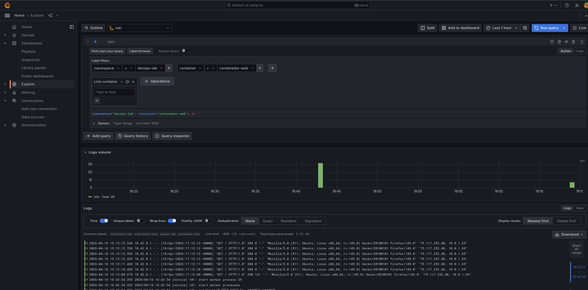
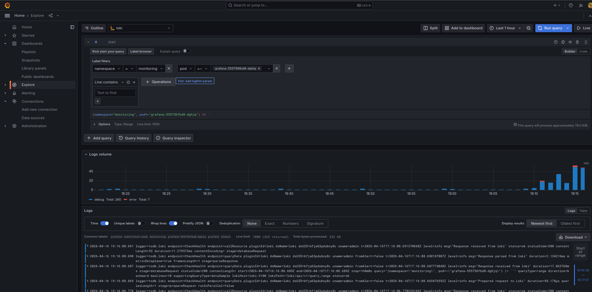

# Phase 4 - Step 5: Loki + Promtail

## Objective

Set up centralized log aggregation using Loki as the log storage backend and Promtail as the log collector DaemonSet, and configure Grafana to query and filter logs by namespace and pod.

---

## Requirements

- Grafana running and accessible.
- `monitoring` namespace exists.

---

## A. Deploy Loki

Loki is deployed as a single-replica `Deployment` using the filesystem storage backend.

- **Image:** `grafana/loki:3.0.0`
- **Port:** `3100`
- **Service type:** `ClusterIP`

```bash
kubectl apply -f loki.yaml
kubectl get pods -n monitoring
```



---

## B. Deploy Promtail

Promtail runs as a `DaemonSet` — one pod per node — and tails log files from `/var/log/pods/`.

- **Image:** `grafana/promtail:3.0.0`
- **Log source:** `/var/log/pods/*/*/*.log`
- **Pipeline stage:** `cri: {}` (required for K3s/containerd — not `docker`)

> [!WARNING]
> K3s uses containerd, not Docker. The pipeline stage must be `cri: {}`. Using `docker: {}` causes Promtail to parse logs incorrectly and discover 0 targets.

```bash
kubectl apply -f promtail.yaml
kubectl get daemonset -n monitoring
```



---

## C. Verify Promtail is Collecting Logs

```bash
# Check active files and targets
kubectl port-forward -n monitoring daemonset/promtail 9080:9080 &
sleep 2
curl -s http://localhost:9080/metrics | grep -E "promtail_files|promtail_targets"
pkill -f "port-forward"
```

Expected output:
```
promtail_files_active_total 23
promtail_targets_active_total 1
```

---

## D. Verify Loki is Receiving Logs

```bash
kubectl port-forward -n monitoring svc/loki 3100:3100 &
sleep 2

# List available label values for namespace
curl -s 'http://localhost:3100/loki/api/v1/label/namespace/values' | \
  python3 -c "import json,sys; print(json.load(sys.stdin))"

pkill -f "port-forward"
```

Expected output:
```
{'status': 'success', 'data': ['devops-lab', 'kube-system', 'monitoring']}
```

---

## E. Configure Loki as Data Source in Grafana

1. Open Grafana → `Connections` → `Data Sources` → `Add data source`
2. Select **Loki**
3. Set URL: `http://loki:3100`
4. Click `Save & test`



---

## F. Filter Logs by Namespace and Pod

Go to `Explore` → select **Loki** as datasource and run these queries:

```
# All logs from the application namespace
{namespace="devops-lab"}

# Only the nginx container
{namespace="devops-lab", container="contenedor-web"}

# Only the metrics sidecar
{namespace="devops-lab", container="nginx-exporter"}

# All monitoring stack logs
{namespace="monitoring"}

# Logs from a specific pod
{pod=~"prometheus.*"}
```







---

> [!NOTE]
> - Promtail uses `static_configs` with a global pattern (`/var/log/pods/*/*/*.log`) instead of `kubernetes_sd_configs`. This is more reliable on single-node K3s clusters where the kubernetes service discovery can produce 0 targets due to edge cases.
> - Labels `namespace`, `pod` and `container` are extracted from the log file path using a regex pipeline stage.
