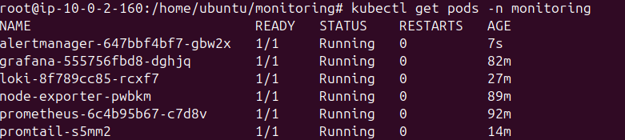
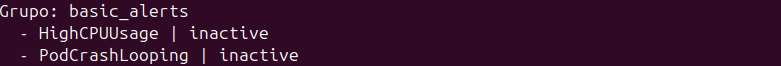
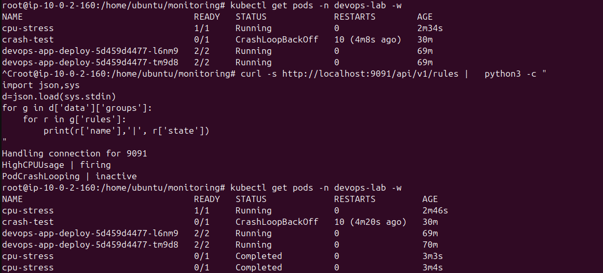
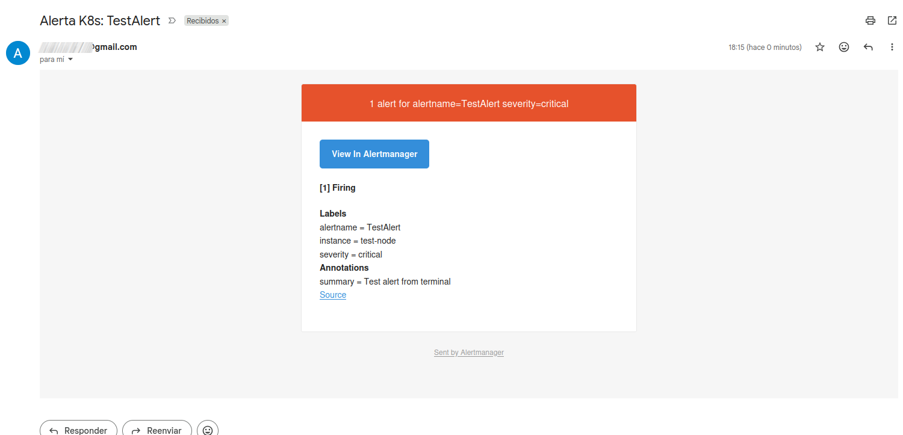
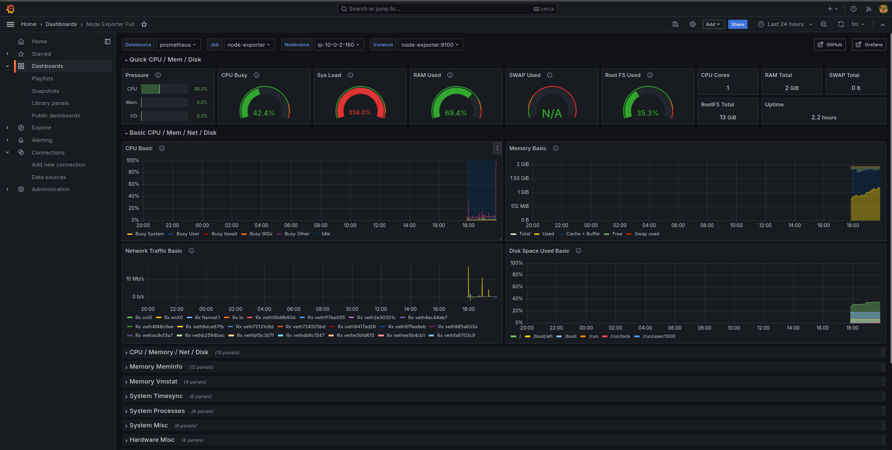

# Phase 4 - Step 6: Alertmanager

## Objective

Deploy Alertmanager manually and configure it to receive alerts from Prometheus and send notifications via email (Gmail). Validate the setup by triggering a real CPU alert.

---

## Requirements

- Prometheus running with alert rules defined in its ConfigMap.
- A Gmail account with an App Password generated.

---

## A. Generate Gmail App Password

Gmail requires an **App Password** for SMTP authentication — your regular password will not work.

1. Go to `myaccount.google.com` → **Security**
2. Enable **2-Step Verification** if not already active
3. Search for **App passwords** → create one named `alertmanager`
4. Copy the 16-character password generated

---

## B. Deploy Alertmanager

The ConfigMap holds `alertmanager.yml` with the routing and receiver configuration.

```bash
kubectl apply -f alertmanager.yaml
kubectl get pods -n monitoring
```



**Routing configuration:**
- Alerts are grouped by `alertname` and `severity`
- `group_wait: 10s` — waits 10 seconds before sending the first notification
- `repeat_interval: 1h` — resends the notification every hour while firing

**Email receiver:**
- Sends to `yourmail@gmail.com`
- Uses Gmail SMTP on port 587 with TLS
- Includes resolved notifications (`send_resolved: true`)

---

## C. Verify Alert Rules are Loaded

```bash
kubectl port-forward -n monitoring svc/prometheus 9095:9090 &
sleep 2

curl -s http://localhost:9095/api/v1/rules | \
  python3 -c "
import json,sys
d=json.load(sys.stdin)
for g in d['data']['groups']:
    for r in g['rules']:
        print(r['name'],'|', r['state'])
"
pkill -f "port-forward"
```

Expected output:
```
HighCPUUsage      | inactive
HighMemoryUsage   | inactive
NodeExporterDown  | inactive
```



---

## D. Verify Prometheus Talks to Alertmanager

```bash
kubectl port-forward -n monitoring svc/prometheus 9095:9090 &
sleep 2
curl -s http://localhost:9095/api/v1/alertmanagers | \
  python3 -c "import json,sys; print(json.load(sys.stdin))"
pkill -f "port-forward"
```

`alertmanager:9093` should appear in the active alertmanagers list.

---

## E. Trigger Alert — CPU Stress Test

Generate artificial CPU load to push usage above 80% and trigger the `HighCPUUsage` alert:

```bash
kubectl run cpu-stress \
  --image=busybox \
  --restart=Never \
  --namespace=devops-lab \
  -- sh -c "for i in 1 2 3 4; do while true; do :; done & done; sleep 180"
```

Monitor the alert state — it transitions from `inactive` → `pending` → `firing`:

```bash
kubectl port-forward -n monitoring svc/prometheus 9095:9090 &
sleep 2
curl -s http://localhost:9095/api/v1/rules | \
  python3 -c "
import json,sys
d=json.load(sys.stdin)
for g in d['data']['groups']:
    for r in g['rules']:
        print(r['name'],'|', r['state'])
"
pkill -f "port-forward"
```

> The alert moves to `pending` when the condition is met. After `for: 2m` it becomes `firing` and Alertmanager sends the notification.







---

## F. Cleanup

```bash
kubectl delete pod cpu-stress -n devops-lab
```

---

> [!NOTE]
> - The `PodCrashLooping` alert rule requires `kube-state-metrics` to expose the `kube_pod_container_status_restarts_total` metric. Since kube-state-metrics is not deployed in this phase, that rule remains `inactive`. It has been replaced with `NodeExporterDown` and `HighMemoryUsage` which use metrics available from Node Exporter.
> - For production, store the Gmail App Password in a Kubernetes `Secret` instead of a plain ConfigMap.
