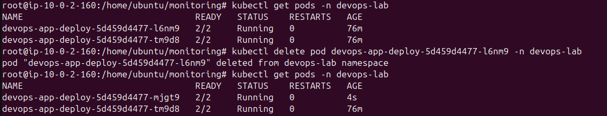
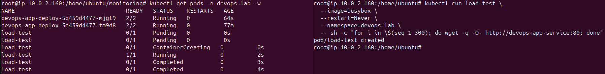
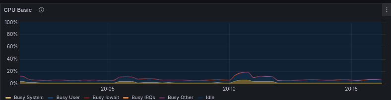
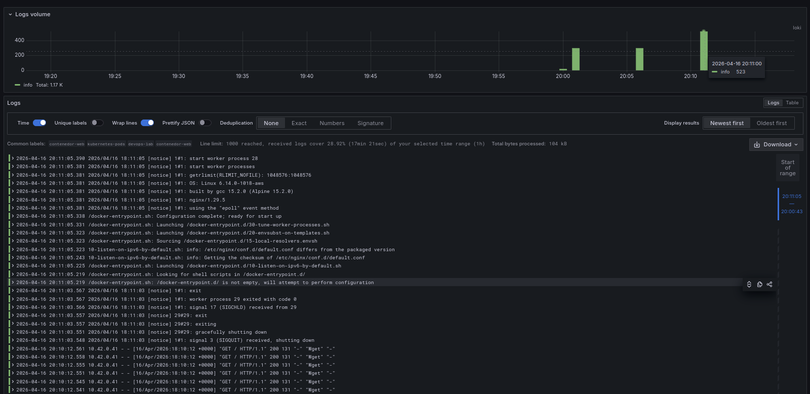
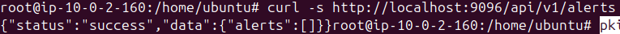

# Phase 4 - Step 7: Mini GameDay (Incident Simulation)

## Objective

Simulate a real incident by manually deleting a pod and generating artificial traffic load. Observe Kubernetes self-healing, verify that metrics and logs capture the event, and document the incident as an SRE exercise.

---

## Requirements

- Full observability stack running (Prometheus, Grafana, Loki, Promtail, Alertmanager).
- Application running in `devops-lab` namespace with at least 2 replicas.

---

## Incident Report

| Field | Value |
|-------|-------|
| **Date** | 2026-04-16 |
| **Environment** | K3s — single node (t2.small) |
| **Namespace** | `devops-lab` |
| **Component** | `devops-app-deploy` |
| **Triggered by** | Manual pod deletion + artificial load (300 requests) |
| **Duration** | ~20 seconds (pod recreation time) |
| **Impact** | Minimal — second replica absorbed traffic during recreation |
| **Alerts fired** | None (CPU stayed below 80% threshold) |
| **Resolution** | Automatic — Kubernetes Deployment controller recreated the pod |

---

## A. Pre-incident State

```bash
kubectl get pods -n devops-lab
```

Both replicas running with `READY 2/2`:

```
NAME                                 READY   STATUS    RESTARTS   AGE
devops-app-deploy-5d459d4477-l6nm9   2/2     Running   0          1h
devops-app-deploy-5d459d4477-tm9d8   2/2     Running   0          1h
```

---

## B. Step 1 — Delete a Pod Manually

```bash
kubectl delete pod devops-app-deploy-5d459d4477-l6nm9 -n devops-lab
```



---

## C. Step 2 — Generate Artificial Load

While the pod is being recreated, send 300 requests to the service:

```bash
kubectl run load-test \
  --image=busybox \
  --restart=Never \
  --namespace=devops-lab \
  -- sh -c "for i in \$(seq 1 300); do wget -q -O- http://devops-app-service:80; done"
```

---

## D. Step 3 — Observe Automatic Pod Recreation

```bash
kubectl get pods -n devops-lab -w
```

Observed lifecycle:

```
devops-app-deploy-5d459d4477-l6nm9   2/2   Running     →  Terminating
devops-app-deploy-5d459d4477-xxxxx   0/2   Pending     →  ContainerCreating  →  Running
```



> Recovery time: approximately 20 seconds from deletion to `Running 2/2`.

> [!NOTE]
> With an active `Deployment` and `ReplicaSet`, the Kubernetes controller reacts almost instantly to the pod deletion — recreation starts before the load test can generate meaningful traffic against the missing replica. In practice, reproducing a window where the surviving replica is visibly absorbing all the load while the other is still down is very hard to capture on a single-node cluster: the pod recovers before most of the 300 requests are even sent. This is precisely the self-healing guarantee that `replicas: 2` provides.

---

## E. Step 4 — Verify Metrics

In Grafana — Node Exporter dashboard:

- CPU showed a minor spike during the load test
- Memory remained stable throughout
- No sustained anomaly — the second replica handled the traffic



---

## F. Step 5 — Verify Logs in Loki

Query in Grafana → Explore → Loki:

```
{namespace="devops-lab", container="contenedor-web"}
```

Logs show the load test requests hitting the surviving replica, followed by access logs from the newly recreated pod once it became ready.



---

## G. Step 5 — Check Alerts

```bash
kubectl port-forward -n monitoring svc/prometheus 9095:9090 &
sleep 2
curl -s http://localhost:9095/api/v1/alerts
pkill -f "port-forward"
```

Result: **No alerts fired** — the incident was too short and the CPU load too low to cross any threshold.



---

## H. Cleanup

```bash
kubectl delete pod load-test -n devops-lab 2>/dev/null
```

---

## Conclusions

| Observation | Result |
|-------------|--------|
| Pod self-healing | ✅ Kubernetes recreated the pod automatically in ~20s |
| Traffic continuity | ✅ Second replica absorbed requests — no total downtime |
| Metrics captured event | ✅ CPU/memory spike visible in Grafana |
| Logs captured event | ✅ Pod restart visible in Loki |
| Alert triggered | ❌ Incident too short — below the 2-minute `for` threshold |

> The `for: 2m` duration in the alert rules prevents false positives from brief spikes. A real production outage lasting more than 2 minutes would trigger the alert correctly.

---

> [!NOTE]
> - Running with `replicas: 2` was critical — it meant the service remained available during pod recreation. With `replicas: 1` there would have been a ~20 second window of total unavailability.
