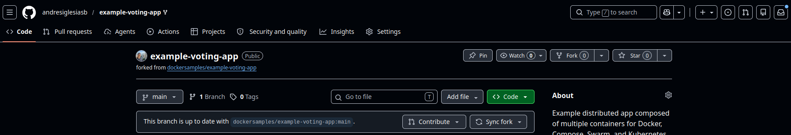
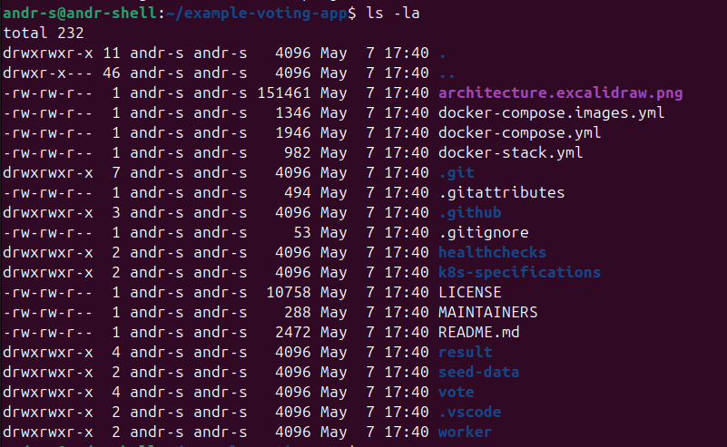

# Phase 5 - Step 1: Application Selection & Preparation

## Objective

Select a multi-service demo application that simulates a realistic distributed system. Fork it to a personal GitHub account so Jenkins can build and push its images, and document its architecture as the foundation for the GitOps workflow introduced in this phase.

---

## Requirements

- A GitHub account with permission to fork public repositories.
- `git` installed locally.
- Docker installed locally (optional — only for building images outside Jenkins).

---

## A. Application — Docker Voting App

The chosen application is the [Docker Voting App](https://github.com/dockersamples/example-voting-app), a reference distributed app composed of **5 services** written in different languages and connected through a queue and a database.

| Service       | Language     | Role                                                         |
|---------------|--------------|--------------------------------------------------------------|
| `vote`        | Python (Flask) | Web UI where users cast votes                              |
| `result`      | Node.js      | Web UI that displays results in real time                    |
| `worker`      | .NET         | Background process that moves votes from Redis to PostgreSQL |
| `redis`       | Redis        | In-memory queue holding incoming votes                       |
| `db`          | PostgreSQL   | Persistent store for tallied results                         |

### Data flow

```
User → vote (Flask)  →  redis  →  worker (.NET)  →  postgres  →  result (Node.js) → User
```

The split makes it a textbook example for testing:
- **Inter-service networking** in Kubernetes (`ClusterIP` for internal hops).
- **Multiple deployment cadences** — vote/result are public-facing, redis/postgres/worker are internal.
- **GitOps drift** — bumping any of the 3 application images must trigger a sync via ArgoCD.

---

## B. Fork the Repository

Forking is required because Jenkins (and Phase 5's GitOps pipeline) needs write access to the manifests repository and at minimum read access to a stable base.

1. Go to [github.com/dockersamples/example-voting-app](https://github.com/dockersamples/example-voting-app)
2. Click **Fork** → keep the default name `example-voting-app`
3. Verify it appears under your account: `https://github.com/<YOUR_USER>/example-voting-app`



---

## C. Clone Locally and Inspect

```bash
git clone https://github.com/<YOUR_USER>/example-voting-app.git
cd example-voting-app
```

Expected top-level layout:

```
example-voting-app/
├── vote/             # Flask app + Dockerfile
├── result/           # Node.js app + Dockerfile
├── worker/           # .NET app + Dockerfile
├── seed-data/        # Test data for load testing
├── docker-compose.yml
├── docker-stack.yml
└── k8s-specifications/   # Reference K8s manifests (will be moved to GitOps repo in Step 2)
```



> Each of `vote/`, `result/` and `worker/` has its own `Dockerfile`. These are the three images Jenkins will build and push in [Step 3](03-jenkins-gitops.md).

> [!WARNING]
> The `worker/Dockerfile` in the original fork uses `FROM --platform=${BUILDPLATFORM}`, a BuildKit multi-platform feature that breaks with the legacy Docker builder. Replace the first build stage before proceeding:
> ```dockerfile
> # Remove this block entirely:
> FROM --platform=${BUILDPLATFORM} mcr.microsoft.com/dotnet/sdk:7.0 AS build
> ARG TARGETPLATFORM
> ARG TARGETARCH
> ARG BUILDPLATFORM
> RUN echo "I am running on $BUILDPLATFORM, building for $TARGETPLATFORM"
> WORKDIR /source
> COPY *.csproj .
> RUN dotnet restore -a $TARGETARCH
> COPY . .
> RUN dotnet publish -c release -o /app -a $TARGETARCH --self-contained false --no-restore
>
> # Replace with:
> FROM mcr.microsoft.com/dotnet/sdk:7.0 AS build
> WORKDIR /source
> COPY *.csproj .
> RUN dotnet restore -a amd64
> COPY . .
> RUN dotnet publish -c release -o /app -a amd64 --self-contained false --no-restore
> ```

---

## D. Identify the K8s Manifests

The repo ships with example manifests under `k8s-specifications/`:

```bash
ls k8s-specifications/
```

Expected files:

```
db-deployment.yaml       redis-deployment.yaml      result-deployment.yaml
db-service.yaml          redis-service.yaml         result-service.yaml
vote-deployment.yaml     vote-service.yaml          worker-deployment.yaml
```

> These manifests are the **starting point** for the GitOps repository created in [Step 2](02-repo-structure.md). They will be copied out, refined (image tags, namespaces, NodePort/Ingress wiring) and committed to a separate repo that ArgoCD will watch.

---

## E. Smoke-test Locally (Optional)

If you have Docker and `docker-compose` available, you can verify the app works end-to-end before involving Kubernetes:

```bash
docker compose up -d
docker compose ps
```

- `vote` should be reachable on `http://localhost:8080`
- `result` should be reachable on `http://localhost:8081`

```bash
docker compose down
```

---

## F. Plan for the Next Steps

| Step | Action |
|------|--------|
| Step 2 | Create the **GitOps repository** and migrate the manifests there with proper image tags and structure. |
| Step 3 | Rewrite the Jenkinsfile so Jenkins **only commits to the GitOps repo** — it no longer runs `kubectl`. |
| Step 4 | Install **ArgoCD** and connect it to the GitOps repo. |
| Step 5 | Wire NGINX routing for `/vote` and `/results`. |
| Step 6 | Extend Prometheus / Loki / Grafana to cover the 5 microservices. |

---

> [!NOTE]
> - The `worker` service has no exposed HTTP port — it is purely a background consumer. This matters in Step 6 when adding observability: `worker` health is inferred from log activity and Redis queue depth, not from HTTP probes.
> - Forking (rather than cloning) is important so any required tweaks to `Dockerfile` or `requirements.txt` can be committed back. Phase 5 does not require code changes, but the fork keeps that door open.
