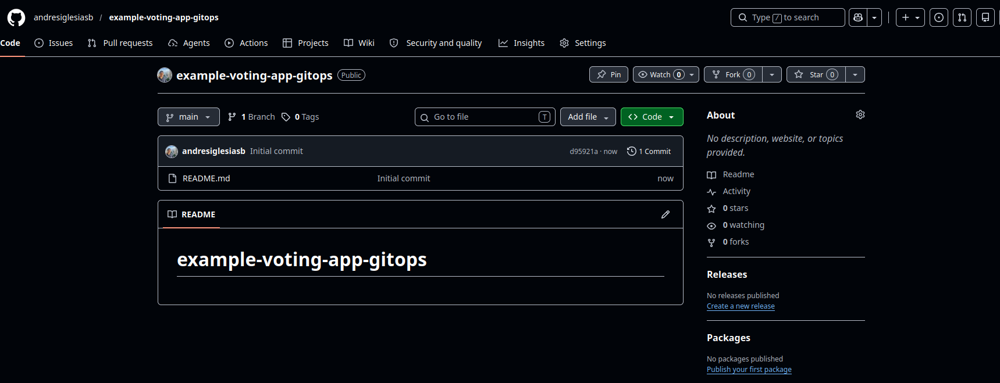

# Phase 5 - Step 2: Repository Structure (GitOps Split)

## Objective

Establish the **GitOps architecture** by separating concerns into two distinct repositories:
- **Repo 1 (App Code):** The forked Voting App — Jenkins builds and pushes images from here.
- **Repo 2 (GitOps/Infra):** A new repository holding only Kubernetes manifests — ArgoCD watches this repo for the desired state.

This separation is the core principle of GitOps: the cluster's state is entirely defined in Git, decoupled from the CI pipeline.

---

## Requirements

- The forked Voting App from [Step 1](01-app-selection.md) cloned locally.
- A GitHub account with permission to create new repositories.

---

## A. The GitOps Pattern: Two Repos

### Repo 1 — Application Code (example-voting-app)

**Purpose:** Source code and Docker build context.
**Ownership:** Application developers.
**Jenkins reads from:** This repo to build images.
**Jenkins writes to:** DockerHub (image push), then commits to Repo 2.

```
andresiglesiasb/example-voting-app
├── vote/
│   ├── Dockerfile       ← Jenkins builds from here
│   ├── app.py
│   └── requirements.txt
├── result/
│   ├── Dockerfile
│   └── server.js
├── worker/
│   ├── Dockerfile
│   └── Program.cs
├── k8s-specifications/  ← Reference only, will be in Repo 2
└── Jenkinsfile          ← Updated in Step 3 to commit to Repo 2
```

### Repo 2 — Kubernetes Manifests (example-voting-app-gitops) — NEW

**Purpose:** Desired state of the cluster as YAML.
**Ownership:** DevOps/SRE (manages manifests, image versions, configurations).
**Jenkins writes to:** This repo when bumping image tags.
**ArgoCD reads from:** This repo constantly to sync the cluster.

```
andresiglesiasb/example-voting-app-gitops/  ← You create this
├── 00-namespace.yaml
├── vote-deployment.yaml         ← Jenkins updates image tag here
├── vote-service.yaml
├── result-deployment.yaml        ← Jenkins updates image tag here
├── result-service.yaml
├── worker-deployment.yaml        ← Jenkins updates image tag here
├── redis-deployment.yaml
├── redis-service.yaml
├── db-deployment.yaml
├── db-service.yaml
└── README.md
```

---

## B. Why Two Repos?

| Aspect | Benefit |
|--------|---------|
| **Code / Config separation** | Developers can modify code without needing to understand K8s manifests. DevOps can refine manifests without touching app code. |
| **Jenkins permissions** | Jenkins only needs push access to Repo 2 and DockerHub — no direct `kubectl` access. Safer, easier to audit. |
| **ArgoCD autonomy** | ArgoCD reads only from Repo 2, avoiding the need to run containers with K8s API credentials. |
| **Rollback / audit trail** | Git history in Repo 2 is the audit log: who changed which image tag and when. |
| **Multiple branches/environments** | Easily create `develop`, `staging`, `production` branches in Repo 2 for different cluster states without affecting app code. |

---

## C. Repo 2 — Create the GitOps Repository

You'll create this repository to hold the manifests. It starts as a copy of the manifests from the forked Voting App, then gets refined.

### Step 1: Create the repo on GitHub

1. Go to **github.com** → **New repository**
2. Name: `example-voting-app-gitops` (or your preference)
3. **Public** (so ArgoCD can read it without authentication, it can also be private. But is needed an extra configuration)
4. Initialize with `README.md`
5. Click **Create repository**

Repo URL: `https://github.com/<YOUR_USER>/example-voting-app-gitops`



### Step 2: Clone locally

```bash
cd ~
git clone https://github.com/<YOUR_USER>/example-voting-app-gitops.git
cd example-voting-app-gitops
```

### Step 3: Copy manifests from the Voting App

The reference manifests exist in `example-voting-app/k8s-specifications/`. Copy them:

```bash
# From inside example-voting-app-gitops/
cp ../example-voting-app/k8s-specifications/*.yaml .

# Verify
ls *.yaml
```

Expected files:

```
db-deployment.yaml       redis-service.yaml       vote-deployment.yaml
db-service.yaml          result-deployment.yaml   vote-service.yaml
redis-deployment.yaml    result-service.yaml      worker-deployment.yaml
```

---

## D. Refine the Manifests for Phase 5

The reference manifests work as-is for local docker-compose, but need adjustments for this lab environment.

### Namespace

All 5 services should run in a dedicated namespace (separate from `monitoring`, `devops-lab`):

```bash
cat > 00-namespace.yaml <<'EOF'
apiVersion: v1
kind: Namespace
metadata:
  name: voting-app
EOF
```

> The `00-` prefix ensures this file is applied first alphabetically, so the namespace exists before the deployments try to use it.

### Update all manifests to specify namespace

Edit each `*-deployment.yaml` and `*-service.yaml`:

**Before:**
```yaml
apiVersion: apps/v1
kind: Deployment
metadata:
  name: vote
```

**After:**
```yaml
apiVersion: apps/v1
kind: Deployment
metadata:
  name: vote
  namespace: voting-app
```

> You can automate this:
> ```bash
> sed -i '/^metadata:$/a\  namespace: voting-app' *.yaml
> ```

### Image tags — ready for Jenkins updates

Only **three** of the deployments use custom-built images — the ones Jenkins will build and push to DockerHub. For each, find the `image:` line inside `spec.template.spec.containers` and replace it with your DockerHub username and a versioned tag:

| File | Find this line | Replace with |
|------|----------------|--------------|
| `vote-deployment.yaml` | `image: dockersamples/examplevotingapp_vote` | `image: <YOUR_DOCKERHUB_USER>/vote:v1.0.0` |
| `result-deployment.yaml` | `image: dockersamples/examplevotingapp_result` | `image: <YOUR_DOCKERHUB_USER>/result:v1.0.0` |
| `worker-deployment.yaml` | `image: dockersamples/examplevotingapp_worker` | `image: <YOUR_DOCKERHUB_USER>/worker:v1.0.0` |

The `image:` line is always inside the `containers` block, near the bottom of each file:

**Before (`vote-deployment.yaml`):**
```yaml
    spec:
      containers:
      - image: dockersamples/examplevotingapp_vote   # ← change this line
        name: vote
```

**After:**
```yaml
    spec:
      containers:
      - image: <YOUR_DOCKERHUB_USER>/vote:v1.0.0     # ← major.minor.patch
        name: vote
```

> [!WARNING]
> Do **not** change `redis-deployment.yaml` or `db-deployment.yaml`. Those use official public images (`redis:alpine`, `postgres:15-alpine`) — they are not built by Jenkins and should stay as-is.

> The tag `v1.0.0` follows semver (major.minor.patch). Jenkins will replace this value in [Step 3](03-jenkins-gitops.md) using `sed`, incrementing the patch on each build (e.g. `v1.0.1`, `v1.0.2`, ...).

### Services — expose vote and result

| Service | Type | Has service.yaml | Reason |
|---------|------|-----------------|--------|
| `vote` | `NodePort` | YES | Receives user traffic |
| `result` | `NodePort` | YES | Serves results to users |
| `redis` | `ClusterIP` | YES | Receives writes from `vote`, read by `worker` |
| `db` | `ClusterIP` | YES | Receives writes from `worker`, read by `result` |
| `worker` | — | NO | Only consumes Redis and PostgreSQL — nothing talks to it, so no Service is needed |

Example for `vote-service.yaml`:

```yaml
apiVersion: v1
kind: Service
metadata:
  name: vote
  namespace: voting-app
spec:
  type: NodePort
  selector:
    app: vote
  ports:
    - port: 80
      targetPort: 80
      nodePort: 31000  # Will be routed via NGINX to /vote
```

---

## E. Commit to Repo 2

```bash
git add *.yaml README.md
git commit -m "feat: initial GitOps manifests for voting app microservices"
git push origin main
```

---

## F. Next Step

| Action | Where |
|--------|-------|
| Create `Jenkinsfile` that writes to Repo 2 | [Step 3 — Jenkins GitOps](03-jenkins-gitops.md) |
| Install ArgoCD to read from Repo 2 | [Step 4 — ArgoCD](04-argocd.md) |

---

> [!NOTE]
> - Both repos are public. In production, Repo 2 should be private with appropriate RBAC on who can commit. For this lab, public is fine.
> - If you make a typo in `image: <YOUR_DOCKER_HUB_USER>/vote:v1.0.0`, you'll need to fix it in Git and push. ArgoCD will then reconcile. This is the advantage of Git as the source of truth — all changes are versioned.
