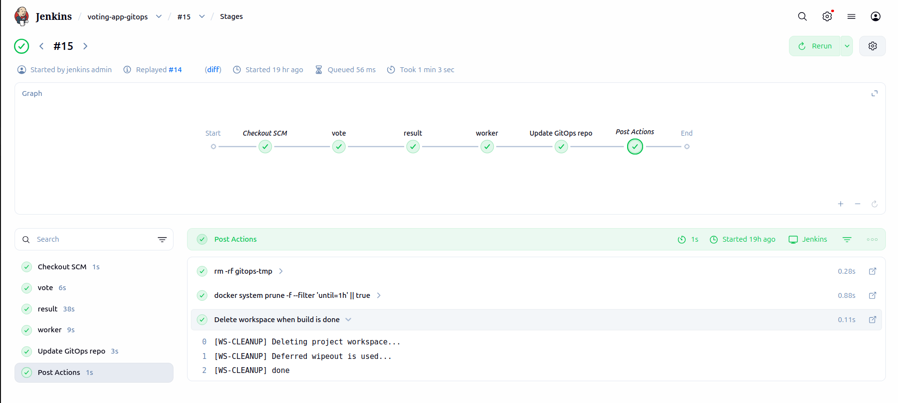

# Phase 5 - Step 3: Jenkins GitOps Pipeline

## Objective

Replace the direct `kubectl apply` approach from Phase 3 with a **GitOps-compatible CI pipeline**. Jenkins will:

1. Build and push the three application images to DockerHub.
2. Clone the GitOps repo, bump the image tags with `sed`, and push the updated manifests back to GitHub.
3. Stop there — ArgoCD (Step 4) takes over and syncs the cluster.

```
Code push
    │
    ▼
Jenkins (CI)
    ├─► DockerHub       ← push vote:v1.0.X, result:v1.0.X, worker:v1.0.X
    └─► GitOps repo     ← git commit "ci: bump image tags to v1.0.X"
                                │
                                ▼
                        ArgoCD (CD)     ← detects change, syncs cluster
                                │
                                ▼
                        Kubernetes      ← rolling update
```

> **Key difference from Phase 3:** Jenkins no longer runs `kubectl`. It only writes to Git. The cluster state is driven entirely by the GitOps repo.

---

## Requirements

- Jenkins running and accessible (from Phase 2).
- The forked `example-voting-app` repo reachable via SCM from Jenkins.
- The `example-voting-app-gitops` repo created and configured (Step 2).
- DockerHub account with push access.
- An SSH key that Jenkins can use to push to the GitOps repo.
- **SSH Agent plugin** installed in Jenkins (`Manage Jenkins → Plugins → Available → SSH Agent`).
- At least **2GB of swap** on the Jenkins server — building three Docker images sequentially requires more memory than a t2.micro or t3.micro provides by default:

```bash
sudo fallocate -l 2G /swapfile
sudo chmod 600 /swapfile
sudo mkswap /swapfile
sudo swapon /swapfile
echo '/swapfile none swap sw 0 0' | sudo tee -a /etc/fstab
```

---

## A. Jenkins Credentials Setup

Jenkins needs two credentials before the pipeline can run.

### A1. DockerHub — push images

1. Go to **Jenkins → Manage Jenkins → Credentials → (global) → Add Credential**
2. Fill in:

| Field | Value |
|-------|-------|
| Kind | Username with password |
| Username | Your DockerHub username |
| Password | Your DockerHub password or access token |
| ID | `dockerhub-credentials` |
| Description | DockerHub push access |

### A2. GitHub SSH key — push to GitOps repo

Jenkins needs write access to `example-voting-app-gitops`. The cleanest way is a dedicated deploy key:

**Step 1 — Generate the key** (on your local machine or the Jenkins server):

```bash
ssh-keygen -t ed25519 -C "jenkins-gitops" -f ~/.ssh/jenkins_gitops -N ""
```

This creates:
- `~/.ssh/jenkins_gitops` — private key (goes into Jenkins)
- `~/.ssh/jenkins_gitops.pub` — public key (goes into GitHub)

**Step 2 — Add the public key to the GitOps repo on GitHub:**

1. Go to `github.com/<YOUR_USER>/example-voting-app-gitops`
2. **Settings → Deploy keys → Add deploy key**
3. Title: `jenkins-gitops`
4. Key: paste the contents of `jenkins_gitops.pub`
5. Check **Allow write access**
6. Click **Add key**

**Step 3 — Add the private key to Jenkins:**

1. **Jenkins → Manage Jenkins → Credentials → (global) → Add Credential**
2. Fill in:

| Field | Value |
|-------|-------|
| Kind | SSH Username with private key |
| ID | `github-gitops-ssh` |
| Username | `git` |
| Private Key | Enter directly → paste the contents of `jenkins_gitops` |

---

## B. The Jenkinsfile

Create a `Jenkinsfile` in the root of the **app repo** (`example-voting-app/Jenkinsfile`):

```groovy
pipeline {
    agent any

    environment {
        DOCKERHUB_USER  = '<YOUR_DOCKERHUB_USER>'
        DOCKERHUB_CREDS = 'dockerhub-credentials'           // Credential ID from step A1
        GITOPS_REPO     = 'git@github.com:<YOUR_USER>/example-voting-app-gitops.git'
        GITOPS_CREDS    = 'github-gitops-ssh'               // Credential ID from step A2
        VERSION         = "v1.0.${BUILD_NUMBER}"            // e.g. v1.0.1, v1.0.2 ...
    }

    stages {

        // Each image is built, pushed and immediately removed before the next one starts.
        // This keeps memory usage flat — never more than one image loaded at a time.

        stage('vote') {
            steps {
                script {
                    docker.withRegistry('', DOCKERHUB_CREDS) {
                        def img = docker.build("${DOCKERHUB_USER}/vote:${VERSION}", "./vote")
                        img.push()
                    }
                    sh "docker rmi ${DOCKERHUB_USER}/vote:${VERSION}"
                }
            }
        }

        stage('result') {
            steps {
                script {
                    docker.withRegistry('', DOCKERHUB_CREDS) {
                        def img = docker.build("${DOCKERHUB_USER}/result:${VERSION}", "./result")
                        img.push()
                    }
                    sh "docker rmi ${DOCKERHUB_USER}/result:${VERSION}"
                }
            }
        }

        stage('worker') {
            steps {
                script {
                    docker.withRegistry('', DOCKERHUB_CREDS) {
                        def img = docker.build("${DOCKERHUB_USER}/worker:${VERSION}", "./worker")
                        img.push()
                    }
                    sh "docker rmi ${DOCKERHUB_USER}/worker:${VERSION}"
                }
            }
        }

        stage('Update GitOps repo') {
            steps {
                sshagent([GITOPS_CREDS]) {
                    sh """
                        rm -rf gitops-tmp
                        GIT_SSH_COMMAND="ssh -o StrictHostKeyChecking=no" git clone ${GITOPS_REPO} gitops-tmp
                        cd gitops-tmp

                        sed -i 's|image: ${DOCKERHUB_USER}/vote:.*|image: ${DOCKERHUB_USER}/vote:${VERSION}|'     vote-deployment.yaml
                        sed -i 's|image: ${DOCKERHUB_USER}/result:.*|image: ${DOCKERHUB_USER}/result:${VERSION}|' result-deployment.yaml
                        sed -i 's|image: ${DOCKERHUB_USER}/worker:.*|image: ${DOCKERHUB_USER}/worker:${VERSION}|' worker-deployment.yaml

                        git config user.email "jenkins@devops-lab"
                        git config user.name "Jenkins"
                        git add vote-deployment.yaml result-deployment.yaml worker-deployment.yaml
                        git commit -m "ci: bump image tags to ${VERSION} [build #${BUILD_NUMBER}]"
                        GIT_SSH_COMMAND="ssh -o StrictHostKeyChecking=no" git push origin main
                    """
                }
            }
        }
    }

    post {
        always {
            sh "rm -rf gitops-tmp"
            sh "docker system prune -f --filter 'until=1h' || true"
            cleanWs()
        }
    }
}
```

### How the version bump works

The `sed` pattern matches the full image line and replaces the tag:

```
image: <YOUR_DOCKERHUB_USER>/vote:v1.0.4   ← before (any existing tag)
image: <YOUR_DOCKERHUB_USER>/vote:v1.0.5   ← after
```

Each Jenkins build increments `BUILD_NUMBER`, so tags go `v1.0.1 → v1.0.2 → v1.0.3 ...`.

> [!WARNING]
> The `sed` pattern must match exactly what is in the YAML file. If the image line has extra spaces or a different format, the replacement will silently fail and the old tag will remain. Always verify the format in your GitOps repo matches the sed pattern before running the pipeline.

---

## C. Place the Jenkinsfile

```bash
# From inside example-voting-app/
touch Jenkinsfile
# paste the content from section B, then:
git add Jenkinsfile
git commit -m "feat: add GitOps Jenkinsfile for phase 5"
git push origin main
```

Expected repo root after this:

```
example-voting-app/
├── vote/
├── result/
├── worker/
├── k8s-specifications/
└── Jenkinsfile          ← new
```

---

## D. Create the Pipeline in Jenkins

1. **Jenkins → New Item**
2. Name: `voting-app-gitops`
3. Type: **Pipeline** → OK
4. Under **Pipeline → Definition**: select **Pipeline script from SCM**
5. SCM: **Git**
6. Repository URL: `https://github.com/<YOUR_USER>/example-voting-app.git`
7. Branch: `*/main`
8. Script Path: `Jenkinsfile`
9. **Save**

> [!NOTE]
> If your app repo is private, add a GitHub credential here too (read-only is enough for SCM checkout).

---

## E. Run the Pipeline

Click **Build Now** and watch the stages:

| Stage | What to verify |
|-------|---------------|
| **vote** | `Successfully built` + `pushed` + `Untagged` (image removed) |
| **result** | Same as vote |
| **worker** | Same as vote |
| **Update GitOps repo** | `git commit` line with `ci: bump image tags to v1.0.X` |

After a successful run, check the GitOps repo on GitHub — the three deployment YAMLs should show the new image tag in the latest commit.



---

## F. Verify the Outcome

**On DockerHub** — confirm the three images appeared:

```
https://hub.docker.com/u/<YOUR_DOCKERHUB_USER>
```

Expected repositories: `vote`, `result`, `worker`, each with tag `v1.0.1`.

**On the GitOps repo** — pull and check the commit:

```bash
git -C ~/aws-devops-repos/example-voting-app-gitops pull
git -C ~/aws-devops-repos/example-voting-app-gitops log --oneline -3
```

Expected:
```
a1b2c3d ci: bump image tags to v1.0.1 [build #1]
d95921a Initial commit
```

**Check the deployment YAMLs reflect the new tag:**

```bash
grep "image:" ~/aws-devops-repos/example-voting-app-gitops/*-deployment.yaml
```

Expected:
```
vote-deployment.yaml:      - image: <YOUR_DOCKERHUB_USER>/vote:v1.0.1
result-deployment.yaml:    - image: <YOUR_DOCKERHUB_USER>/result:v1.0.1
worker-deployment.yaml:    - image: <YOUR_DOCKERHUB_USER>/worker:v1.0.1
```

---

## G. Next Step

| Action | Where |
|--------|-------|
| Install ArgoCD and point it at the GitOps repo | [Step 4 — ArgoCD](04-argocd.md) |

Once ArgoCD is connected, every commit Jenkins pushes to the GitOps repo will automatically trigger a rolling update in the cluster — completing the full GitOps loop.

---

> [!NOTE]
> - `redis` and `db` images are **not built or pushed** by this pipeline — they use official public images that do not change.
> - The `gitops-tmp` directory is always cleaned up in `post`, even if the pipeline fails.
> - To roll back, revert the commit in the GitOps repo with `git revert HEAD` — ArgoCD will detect the change and redeploy the previous tag automatically.
