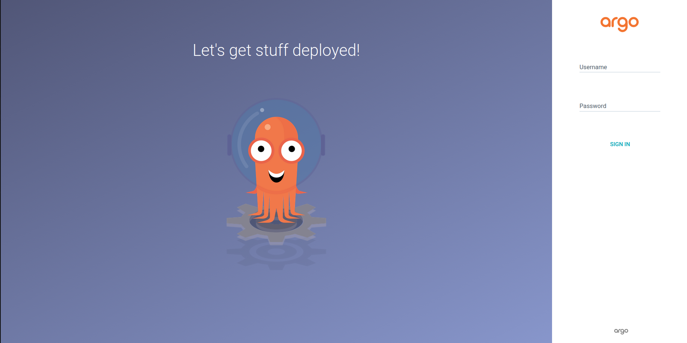
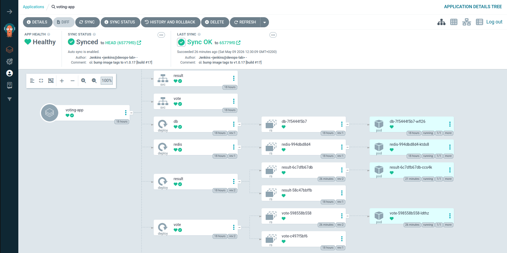

# Phase 5 - Step 4: ArgoCD

## Objective

Install ArgoCD on the cluster and connect it to the GitOps repository. From this point on, any commit Jenkins pushes to `example-voting-app-gitops` will be automatically detected and applied to the cluster — completing the GitOps loop.

```
Jenkins pushes commit to GitOps repo
            │
            ▼
        ArgoCD detects drift
            │
            ▼
        kubectl apply (rolling update)
            │
            ▼
        Cluster matches Git state
```

---

## Requirements

- k3s cluster running and accessible via SSH (from Phase 3).
- The `example-voting-app-gitops` repo on GitHub with the manifests from Step 2.
- Jenkins pipeline from Step 3 working (at least one successful build).
- SSH tunnel to the cluster for UI access.

---

## Infrastructure Sizing

Installing ArgoCD deploys 7 new pods on the cluster. Combined with the monitoring stack (Prometheus, Grafana, node-exporter), the voting app with its 5 microservices, and the k3s components themselves, a **t2.micro or t3.micro** instance (1 GB RAM) runs out of resources: the node starts responding slowly, the Kubernetes API stops answering, and Alertmanager begins firing high-CPU alerts.

During the lab we made two adjustments to fix this:

**1 — 2 GB swap on the Kubernetes node**

We added a 2 GB swap file so the OS can move memory pages that aren't actively in use to disk. This prevents processes from being killed for lack of RAM during load spikes, although it's not a substitute for having enough real memory:

```bash
sudo fallocate -l 2G /swapfile
sudo chmod 600 /swapfile
sudo mkswap /swapfile
sudo swapon /swapfile
echo '/swapfile none swap sw 0 0' | sudo tee -a /etc/fstab
```

**2 — Resizing the instance to t3.medium**

As a permanent fix, we changed the instance type from t3.micro to **t2.small** (2 vCPU, 4 GB RAM) via the AWS console (stop instance → Change Instance Type → start). k3s persists its state to disk, so all pods come back up on their own after the restart with no reconfiguration needed. With 4 GB the node has enough headroom to run the whole stack comfortably.

---

## A. Install ArgoCD

ArgoCD runs in its own namespace. Apply the official install manifest:

```bash
ssh k8s
sudo kubectl create namespace argocd
sudo kubectl apply -n argocd -f https://raw.githubusercontent.com/argoproj/argo-cd/stable/manifests/install.yaml
```

Wait until all pods are running (takes 1-2 minutes):

```bash
sudo kubectl get pods -n argocd -w
```

Expected — all pods should reach `Running` or `Completed`:

```
argocd-application-controller-0          1/1   Running     0   90s
argocd-applicationset-controller-...     1/1   Running     0   90s
argocd-dex-server-...                    1/1   Running     0   90s
argocd-notifications-controller-...      1/1   Running     0   90s
argocd-redis-...                         1/1   Running     0   90s
argocd-repo-server-...                   1/1   Running     0   90s
argocd-server-...                        1/1   Running     0   90s
```

Press `Ctrl+C` once they are all running.

---

## B. Access the ArgoCD UI

ArgoCD server is only reachable inside the cluster by default. Use `kubectl port-forward` combined with your SSH tunnel:

**On the k8s node** (or keep it running in the background):

```bash
sudo kubectl port-forward svc/argocd-server -n argocd 8090:443 --address 0.0.0.0 &
```

**On your local machine**, add the port to your SSH tunnel:

```bash
ssh -fNL 8090:localhost:8090 k8s
```

Open the UI at: `https://localhost:8090`

> [!NOTE]
> The browser will show a TLS warning — ArgoCD uses a self-signed certificate by default. Accept and continue.

**Get the initial admin password:**

```bash
ssh k8s "sudo kubectl -n argocd get secret argocd-initial-admin-secret -o jsonpath='{.data.password}' | base64 -d && echo"
```

Login with:
- Username: `admin`
- Password: the output of the command above



---

## C. Create the ArgoCD Application

An ArgoCD **Application** is the resource that links a Git repo to a cluster namespace. Create it from the UI or with the CLI.

### Option 1 — UI (recommended for first time)

1. Click **+ New App**
2. Fill in the form:

**General:**

| Field | Value |
|-------|-------|
| Application Name | `voting-app` |
| Project | `default` |
| Sync Policy | `Automatic` |
| ☑ Prune Resources | enabled |
| ☑ Self Heal | enabled |

**Source:**

| Field | Value |
|-------|-------|
| Repository URL | `https://github.com/<YOUR_USER>/example-voting-app-gitops` |
| Revision | `HEAD` |
| Path | `.` |

**Destination:**

| Field | Value |
|-------|-------|
| Cluster URL | `https://kubernetes.default.svc` |
| Namespace | `voting-app` |

3. Click **Create**

### Option 2 — CLI

Install the ArgoCD CLI locally:

```bash
curl -sSL -o argocd https://github.com/argoproj/argo-cd/releases/latest/download/argocd-linux-amd64
chmod +x argocd && sudo mv argocd /usr/local/bin/
```

Login:

```bash
argocd login localhost:8090 --username admin --password <PASSWORD> --insecure
```

Create the Application:

```bash
argocd app create voting-app \
  --repo https://github.com/<YOUR_USER>/example-voting-app-gitops \
  --path . \
  --dest-server https://kubernetes.default.svc \
  --dest-namespace voting-app \
  --sync-policy automated \
  --auto-prune \
  --self-heal
```

---

## D. Verify the First Sync

After creating the Application, ArgoCD will immediately detect that the cluster doesn't have the `voting-app` namespace or any of its resources, and will sync.

Watch the sync on the cluster:

```bash
ssh k8s "sudo kubectl get pods -n voting-app -w"
```

Expected — all 5 pods should eventually reach `Running`:

```
NAME                      READY   STATUS    RESTARTS   AGE
db-...                    1/1     Running   0          60s
redis-...                 1/1     Running   0          60s
result-...                1/1     Running   0          60s
vote-...                  1/1     Running   0          60s
worker-...                1/1     Running   0          60s
```

In the ArgoCD UI the Application should show **Synced** and **Healthy**.



> [!NOTE]
> The `worker` pod may take longer to start — it depends on `redis` and `db` being ready first. If it restarts a few times initially, that is normal (`CrashLoopBackOff` → `Running`).

---

## E. Test the Full GitOps Loop

Trigger a new Jenkins build (**Build Now**). When it completes:

1. Jenkins pushes a commit to `example-voting-app-gitops` bumping the image tags.
2. ArgoCD detects the new commit (polls every 3 minutes by default).
3. ArgoCD applies the updated deployments — Kubernetes does a rolling update.

Verify on the cluster that the new image tag is running:

```bash
ssh k8s "sudo kubectl get pods -n voting-app -o jsonpath='{range .items[*]}{.metadata.name}{\"\\t\"}{.spec.containers[0].image}{\"\\n\"}{end}'"
```

Expected output (tags should match the latest build):

```
db-...        postgres:15-alpine
redis-...     redis:alpine
result-...    <YOUR_DOCKERHUB_USER>/result:v1.0.X
vote-...      <YOUR_DOCKERHUB_USER>/vote:v1.0.X
worker-...    <YOUR_DOCKERHUB_USER>/worker:v1.0.X
```

---

## F. Access the Voting App

The `vote` and `result` services are exposed as `NodePort` on the cluster node (`10.0.2.160`):

| Service | NodePort | URL via tunnel |
|---------|----------|----------------|
| vote | 31000 | `http://localhost:31000` |
| result | 31001 | `http://localhost:31001` |

Add the ports to your local SSH tunnel:

```bash
ssh -fNL 31000:localhost:31000 k8s
ssh -fNL 31001:localhost:31001 k8s
```

Open `http://localhost:31000` to cast a vote and `http://localhost:31001` to see the results update in real time.

---

## G. Next Step

| Action | Where |
|--------|-------|
| Replace NodePorts with Traefik Ingress and clean URLs | [Step 5 — Ingress & Routing](05-ingress.md) |

---

> [!NOTE]
> - ArgoCD polls the Git repo every **3 minutes** by default. To trigger an immediate sync, click **Sync** in the UI or run `argocd app sync voting-app`.
> - If a pod gets stuck in `ImagePullBackOff`, the image tag in the GitOps repo doesn't exist on DockerHub — check that the Jenkins build that pushed it succeeded.
> - To roll back to a previous version: open the Application in the UI → **History** → select a previous sync → **Rollback**. ArgoCD will revert the Git commit pointer and re-apply.
