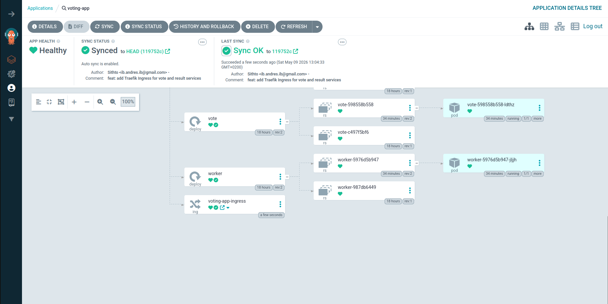

# Phase 5 - Step 5: Ingress & URL Routing

## Objective

Replace the raw NodePort access with a proper **Kubernetes Ingress** that routes by hostname through a single port. Each service gets a clean URL, and all traffic enters through Traefik — the ingress controller that ships built-in with k3s.

```
Browser (local)
      │
      │  http://vote.local:8080      (Host header → vote)
      │  http://result.local:8080    (Host header → result)
      ▼
SSH tunnel  (:8080 → :80 on k8s node)
      │
      ▼
Traefik  (port 80, already running in kube-system)
      │
      ├──► vote.local   ──► Service: vote   (ClusterIP :80) ──► vote pod
      └──► result.local ──► Service: result (ClusterIP :80) ──► result pod
```

---

## Requirements

- ArgoCD connected and the `voting-app` Application synced (Step 4).
- The `example-voting-app-gitops` repo cloned locally.
- k3s running on the cluster node (Traefik is already installed by default).

---

## A. Verify Traefik is Running

k3s pre-installs Traefik as a DaemonSet in `kube-system`. Confirm it is up before proceeding:

```bash
ssh k8s "sudo kubectl get pods -n kube-system -l app.kubernetes.io/name=traefik"
```

Expected:

```
NAME            READY   STATUS    RESTARTS   AGE
traefik-xxxxx   1/1     Running   0          ...
```

Traefik listens on **port 80** (HTTP) and **443** (HTTPS) of the host node. Any `Ingress` resource created in the cluster is picked up automatically — no extra configuration needed.

---

## B. Add the Ingress Manifest to the GitOps Repo

In `example-voting-app-gitops/`, create `ingress.yaml`:

```yaml
apiVersion: networking.k8s.io/v1
kind: Ingress
metadata:
  name: voting-app-ingress
  namespace: voting-app
  annotations:
    traefik.ingress.kubernetes.io/router.entrypoints: web
spec:
  rules:
  - host: vote.local
    http:
      paths:
      - path: /
        pathType: Prefix
        backend:
          service:
            name: vote
            port:
              number: 8080
  - host: result.local
    http:
      paths:
      - path: /
        pathType: Prefix
        backend:
          service:
            name: result
            port:
              number: 8081
```

Commit and push:

```bash
cd ~/aws-devops-repos/example-voting-app-gitops
git add ingress.yaml
git commit -m "feat: add Traefik Ingress for vote and result services"
git push origin main
```

ArgoCD detects the new commit and applies the Ingress within **3 minutes**. To apply immediately, click **Sync** in the UI or run:

```bash
argocd app sync voting-app
```



---

## C. Add Local `/etc/hosts` Entries

On your **local machine**, map both hostnames to localhost (the tunnel endpoint):

```bash
echo "127.0.0.1 vote.local result.local" | sudo tee -a /etc/hosts
```

Verify:

```bash
grep "vote.local" /etc/hosts
# 127.0.0.1 vote.local result.local
```

---

## D. Open the SSH Tunnel on Port 80

Traefik listens on port 80 of the k8s node. Forward it to local port **8080** (port 80 locally requires root):

```bash
ssh -fNL 8080:localhost:80 k8s
```

> [!NOTE]
> Browsers automatically include the `Host` header even on non-standard ports, so `http://vote.local:8080` sends `Host: vote.local` and Traefik routes it correctly.

---

## E. Verify Access

Open in your browser:

| URL | Service |
|-----|---------|
| `http://vote.local:8080` | Voting interface |
| `http://result.local:8080` | Live results |

Or test from the terminal:

```bash
curl -s -o /dev/null -w "%{http_code}\n" http://vote.local:8080
curl -s -o /dev/null -w "%{http_code}\n" http://result.local:8080
```

Expected: `200` for both.

---

## F. Confirm the Ingress on the Cluster

```bash
ssh k8s "sudo kubectl get ingress -n voting-app"
```

Expected:

```
NAME                  CLASS     HOSTS                     ADDRESS      PORTS   AGE
voting-app-ingress    traefik   vote.local,result.local   10.0.2.160   80      2m
```

---

## G. Next Step

| Action | Where |
|--------|-------|
| Extend Prometheus and Grafana to cover the 5 microservices | [Step 6 — Observability](06-observability.md) |

---

> [!NOTE]
> - The old NodePorts (31000/31001) still work alongside the Ingress. Once you confirm the Ingress works, you can switch the vote and result services from `NodePort` to `ClusterIP` in the GitOps repo — ArgoCD will apply the change.
> - To add a new service, add another `rules` entry to `ingress.yaml`, push, and ArgoCD syncs it automatically.
> - Traefik also handles TLS with a `tls:` block and a certificate secret — not required for this lab but straightforward to add.
